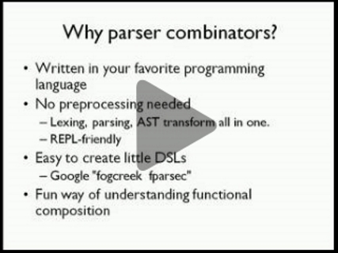

This page contains links to the slides and code from my talk "Understanding parser combinators".

Here's the blurb for the talk:

> Traditionally, writing parsers has been hard, involving arcane tools like Lex and Yacc.
> An alternative approach is to write a parser in your favourite programming language,
> using a "parser combinator" library and concepts no more complicated than regular expressions.
> \
> \
> In this talk, we'll do a deep dive into parser combinators.
> We'll build a parser combinator library from scratch in F# using functional programming techniques,
> and then use it to implement a full featured JSON parser.

This talk is based on my blog posts on this topic:

* [Understanding parser combinators](/series/understanding-parser-combinators.html)

## Videos

Video from NDC Oslo, Jun 9, 2016 (Click image to view video)

## Slides

Slides from NDC Oslo, Jun 9, 2016



