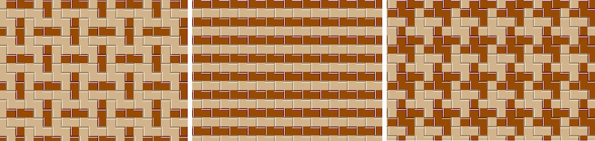
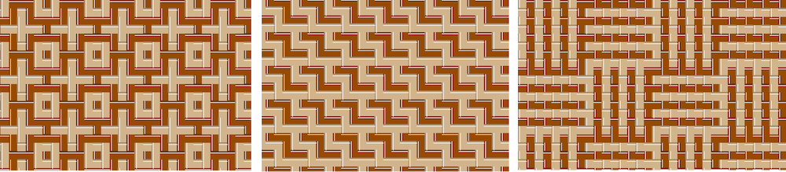
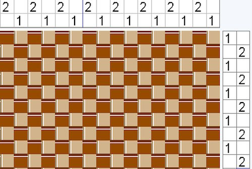
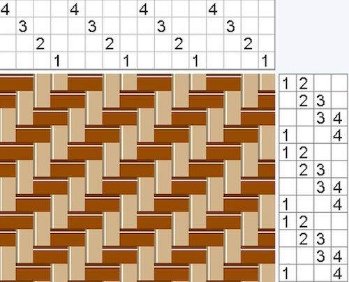
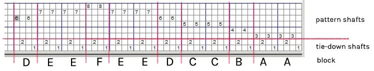
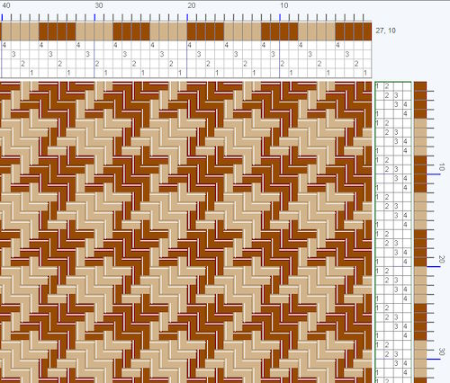
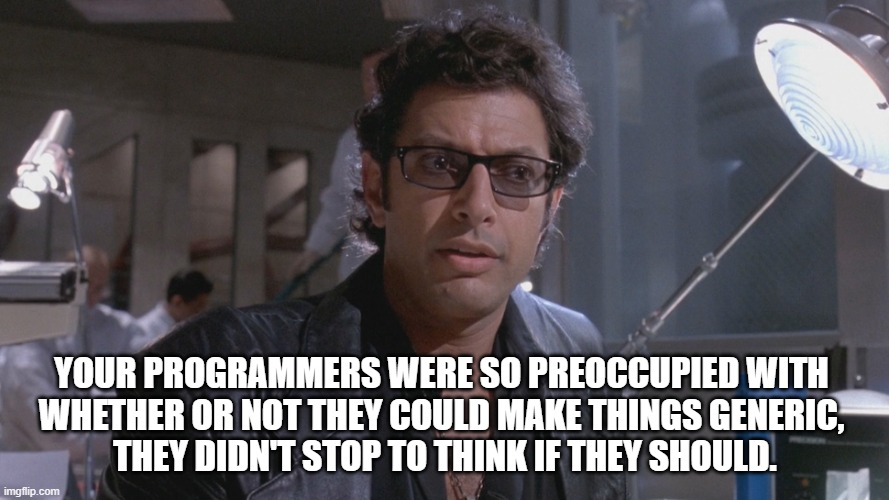
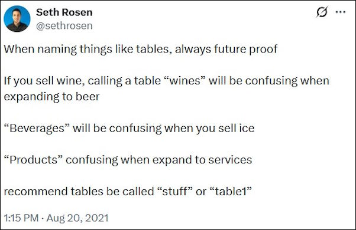

> This post is part of the [2025 F# Advent Calendar](https://sergeytihon.com/2025/11/03/f-advent-calendar-in-english-2025/).
> Check out all the other great posts there! And special thanks to Sergey Tihon for organizing this.

Recently, I have taken up a new hobby, hand weaving. As a meditative, physical activity with tangible results, it's a great antidote to doom-scrolling and spending too much time in front of a screen. The first time I tried it, something about the weaving  process really appealed to me and I got a little bit obsessed with learning more.  It turns out that weaving is a subject with never-ending depth to it, much like learning to play a musical instrument.  And like any sensible programmer, I wanted to take what I learned and write software for it.

This series of posts describes how I went about designing some weaving software, and some of the decisions I took. This domain is very different from my usual topic of BLOBAS (Boring Line Of Business Applications), so I was curious to see if my usual approach would even be useful.

Now in order to understand some of the design decisions I made, you'll need to understand the domain.  And since most of my readers will know nothing about weaving, forgive me if I spend some time up front in this post explaining it. 


## Why does weaving appeal to programmers?


Unlike superficially similar fiber arts like knitting or crocheting, weaving involves a lot of almost "programming-like" upfront planning. Furthermore, some very interesting effects occur when two threads are interwoven in complicated ways. I think this appeals to programmers in the same way that generative art like fractals and [L-systems](https://en.wikipedia.org/wiki/L-system) do.

And it seems that I'm not the only programmer who is attracted to weaving. 

* When I first started researching weaving patterns, I frequently came across the name of [Ralph Griswold](https://en.wikipedia.org/wiki/Ralph_Griswold). That rang a bell for me, because [his book on the Icon programming language](https://archive.org/details/iconprogrammingl0000gris) was one of the first books I owned when I started programming. He was also into weaving and created a [large archive of weaving resources](https://www2.cs.arizona.edu/patterns/weaving/index.html) at the University of Arizona, where he was a professor.
* [Betty Shannon](https://en.wikipedia.org/wiki/Betty_Shannon), a mathematician and the wife of Claude Shannon, was a serious weaver.
* [Kris Bruland](https://handwovenmagazine.com/handweaving-net-from-the-beginning-and-into-the-future/) is a software architect who has built a massive and impressive weaving site called [handweaving.net](https://handweaving.net/).
* And of course, we all know that the use of punch cards in early computers can be directly traced to the [Jacquard loom](https://en.wikipedia.org/wiki/Jacquard_machine#Importance_in_computing).

## Why weaving software?

So having said that I use weaving to get away from a screen, why is software involved?

Unlike knitting and crocheting, where you work work with a single thread, there are always *two* threads involved when weaving, the up-and-down threads, called the *warp*, and the side-to-side threads, called the *weft*. These threads go over and under each other in complex ways.

* The weave structure -- how the warp and weft threads go over and under each other -- can get very convoluted.
* The warp and weft threads can be different colors, in which case you get [optical color mixing](https://studiochalkboard.evansville.edu/c-optics.html).
* The relationships between adjacent colors can also create optical effects. 

This all means that the interaction between the structure of the weave and the individual thread colors can create striking and non-intuitive designs. 

For example, here are three different designs using exactly the same weave structure, but slightly changing the color pattern of the threads.



And here are three different designs using exactly the same color pattern (alternating dark & light colors), but slightly diferent weave structures.




And these examples use only two colors, and very simple weave structures. It can get a lot more complicated than this!


So, in order to visualize the interactions between weaving structure and colors, many weavers use weaving software which can preview the design for you before you go the trouble of setting up the loom.  Many of these are excellent programs, but there are a couple of issues that made me want to implement my own one.

First, most of these are desktop apps rather than web apps. It means that if you want to share your work, you can't just send an URL, you have to export to a file and then send the file.

Second, and more importantly, the apps work on a thread by thread by basis, rather than being able to work at a higher, more abstract level. But to show you what I mean, I have to explain how weaving is designed.

## Communicating weaving design through "drafts"

Let's start with plainweave, the most basic structure. In plainweave you lift up every other vertical (warp) thread to make a gap, and then you feed a horizontal weft thread between them. In the next row, you lift the other half of the threads and pass through another weft thread. This creates the classic over-and-under look.`

How would you communicate this process to someone else? This is what a "weaving draft" does. It's a visual way of communicating a weaving design. 

The most common way of drawing a draft is to draw grids on the top and right side of the pattern. The grids are filled in according to which threads are lifted up or down at each step. Here's the weaving draft for plain weave. 



* The grid above the design (the "threading") indicates how the warp threads are grouped. The grid is read right-to-left, so the first vertical warp thread (on the far right) is in group 1. The second thread is in group 2, the 3rd thread is in group 1 again. And so on. These groups are called "shafts". On a physical loom all the threads in the same group really are tied together onto a single shaft which is then lifted up when required.

* The grid on the right of the design (the "liftplan") describes which shafts are lifted for each row. In the first row, shaft 1 is lifted, which in turn lifts half of the warp threads. In the second row, shaft 2 is lifted, which lifts the other half of the warp threads.

Now let's look at another draft. This time for the weave structure called twill, which has a distinctive diagonal pattern effect (the denim in jeans is a twill).




* On the threading (top) grid, there are now four rows, indicating four groups of threads or shafts. Each warp thread is assigned to a shaft in a linear sequence. After 4 threads, the sequence is repeated.

* The liftplan grid (on the right) tells us that for the first row, we must lift both shaft 1 and shaft 2. For the second row, we must lift both shaft 2 and shaft 3. And so on. After the 4th row, the sequence is repeated.

So now that you understand how a draft works, you can understand how most weaving software works. To design a draft, you simply click the little squares in the top or right grid and see what effect it has on the design. It really is a lot of fun to click around and see the pattern changing each time.

## A generative approach to design

If you're a programmer, you will notice that both the weaving drafts above have some very obvious patterns. In the twill draft, for example, the top grid has the pattern "1 2 3 4" repeated 4 times. And similarly, the the liftplan grid has the same "1&2, 2&3, 3&4, 1&4" pattern repeated. 

As a user, if I want to indicate that I have 100 threads in the 1-2-3-4 pattern, I don't want to have to click each one of 100 squares in the threading grid. And similarly, if I am lifting the same pattern of shafts over and over, I don't want to have to click squares in the liftplan repeatedly.

Most weaving software apps do provide tools to make it easy to draw the most common grid patterns, such as straight lines and zigzags, but the fundamental basis of the design is still thread-by-thread. I wanted a *generative* approach, where I could specify a pattern, and the software would generate the individual threads for me. 

For example, I would like to say "repeat the pattern [1 2 3 4] 4 times" and it would generate the threading pattern for twill shown above.

In fact, weavers already do this in some contexts. They might label a threading pattern [1 3 2 3] "block A" and a pattern [1 4 2 4] "block B", and another pattern "block C", and then they might say something like "A, A, B, C". Here's a pattern called "Summer and Winter" that has labeled blocks like this:



Similarly, when it comes to color, I would like to do the same thing. In the houndstooth draft below, I would like to say "repeat the 1st color 4 times. then repeat the 2nd color 4 times."  



Furthermore, I would like to use an indirect reference like "1st color" rather than a specific color like "brown". This means I can easily swap between different color palettes to see which color combinations I like best.

## A weaving design language

As a programmer, this concept of "groups" and "repeats" immediately made me think of regular expressions. And so in my head, I came up with a syntax for describing a pattern:

A pattern is:

* A single number representing a shaft or color. E.g `"1"`
* A group of threads or labeled blocks. E.g "`[ 1 2 3 4]`" or "`[A B]`"
* A way of labeling a group of threads. E.g "`A=[ 1 2 ]; B=[3 4]`"
* A repeat of any of the above. E.g "`1x2 [3 4]x3 [A B]x4`"


## A domain-driven weaving model

Finally, time for some code! I've always claimed that a good domain model should be somewhat self-documenting, so here is my domain model for the threading grid. How well can you  understand the domain model just from reading the code?


```fsharp
type ThreadingBlock =
  /// A single thread
  | Single of ThreadingEnd

  /// A collection of threads or subgroups
  | InlineGroup of ThreadingBlock list

  /// References a definition defined separately using a letter label
  | LabeledGroup of GroupLabel

  /// A repeat of a single thread or group of threads
  | Repeat of ThreadingBlock * RepeatCount
```

As you can see, I'm trying to reproduce the vocabulary in the code. There is no `int` or `string` anywhere. 

Also, reading this, you can see that there is a new word: `ThreadingEnd`. This is in fact the weaver's terminology for a single thread in a warp threading. So by reading this domain code, you just learned some new vocabulary from the domain!

There are two other types mentioned, both constrained simple types:

```fsharp
// Constrained to be in the range 1..1000
type RepeatCount = RepeatCount of int

// Constrained to be a letter in the range A..Z
type GroupLabel = GroupLabel of string
```

I'm not worried about the overhead of all these types, because the designs will generally be small, and only a few 10's of these types will be allocated in practice.

A separate lettered group is defined as follows:

```fsharp
/// The definition of a labeled ThreadingBlock that can be
/// derefenced when building the draft
type LabeledThreadingGroup = {
  Label: GroupLabel
  Blocks : ThreadingBlock list
  }
```

And now I can put this together into the overall definition of a Threading:

```fsharp
type Threading = {
  // the main definition
  Blocks: ThreadingBlock list
  // other groups that can be deferenced in the main definition
  LabeledGroups : LabeledThreadingGroup list
}

```

With these types, I should be able to generate the above "Summer and Winter" threading pattern from a textual representation like this:


```text
A = 1 3 2 3
B = 1 4 2 4
C = 1 5 2 5
D = 1 6 2 6
Threading = Ax2 B Cx2 D
```

The design of the liftplan grid is very similar. Note the new type `LiftplanPick`. And indeed, the weaver's term for a single row in the weft is called a "pick". So some more vocabulary for you.


```fsharp
type LiftplanBlock =
  | Single of LiftplanPick
  | InlineGroup of LiftplanBlock list
  | LabeledGroup of GroupLabel
  | Repeat of LiftplanBlock * RepeatCount
  
type Liftplan = {
    // the main definition
    Blocks: LiftplanBlock list
    // other groups that can be deferenced in the main definition
    LabeledGroups : LabeledLiftplanGroup list
}
```

And the design for color patterns is similar again, except instead of having a thread as the single unit, we have a color index into a palette.

```fsharp
/// Color index into palettes.
/// Designed to be human readable and so is 1-based.
type ColorIndex = ColorIndex of int

type ColorPatternUnit =
  | Single of ColorIndex
  | InlineGroup of ColorPatternUnit list
  | LabeledGroup of GroupLabel
  | Repeat of ColorPatternUnit * RepeatCount
  
type ColorPattern = {
    // the main definition
    Units: ColorPatternUnit list
    // other groups that can be deferenced in the main definition
    LabeledGroups : LabeledPatternUnit list
}
 
```


## My first design challenge

You can see that all these types are extremely similar in shape. Couldn't we prevent this duplication and come up with a more generic type that could represent all three designs?

Yes we can, and here it is:

```fsharp
type Block<'single> =
  | Single of 'single
  | InlineGroup of Block<'single> list
  | LabeledGroup of GroupLabel
  | Transform of Block<'single> * RepeatCount
  
type LabeledGroup<'single> = {
  Label: GroupLabel
  Blocks : Block<'single> list
  }

type Pattern<'single> = {
  Blocks: Block<'single> list
  LabeledGroups : LabeledGroup<'single> list
}
```

You can see that I've parameterized the type with `'single` so that `ThreadingEnd`, `LiftplanPick` or `ColorIndex` can be used.

```fsharp
type ThreadingBlock = Block<ThreadingEnd>
type Threading = Pattern<ThreadingEnd>

type LiftplanBlock = Block<LiftplanPick>
type Liftplan = Pattern<LiftplanPick>

type ColorPatternUnit = Block<ColorIndex>
type ColorPattern = Pattern<ColorIndex>
```

But now let's say I want to change the structure of the color patterns to include a mirror image of the pattern, a very common situation.

```fsharp
type ColorPatternUnit =
  | Single of ColorIndex
  | InlineGroup of ColorPatternUnit list
  | LabeledGroup of GroupLabel
  | Repeat of ColorPatternUnit * RepeatCount
  | Mirrored of ColorPatternUnit 
```

Now we are running into the same problem that you often have with inheritance heirarchies in object-oriented design. There is some special case that doesn't fit.

This particular case can be handled by adding another type parameter to represent a "transform".


```fsharp
type Block<'single,'transform> =
  | Single of 'single
  | InlineGroup of Block<'single,'transform> list
  | LabeledGroup of GroupLabel
  | Transform of Block<'single,'transform> * 'transform
```

So now we can write the color pattern as 


```fsharp
type ColorPatternTransform =
| Repeat of RepeatCount
| Mirror

type ColorPatternUnit = Block<ColorIndex,ColorPatternTransform>
```

while preserving the original "repeat" option for the other two:


```fsharp
type WeaveTransform =
  | Repeat of RepeatCount

type ThreadingBlock = Block<ThreadingEnd,WeaveTransform>
type LiftplanBlock = Block<LiftplanPick,WeaveTransform>
```

## Is making things too generic a bad idea?

So we have now replaced three types with a single generic type, and avoided some duplication. Surely this is a good idea, yes? Here's Ian Malcolm's take:



Reducing duplication is a good idea in general, but in this particular case, I think that making the domain types completely generic risks making the domain code more confusing and less understandable.

Yes, the non-generic types do have duplicate structures, but the domain vocabulary within them is different, like "end" vs "pick". Vocabulary like that gets eliminated when making a generic type.  One of the goals of domain driven design is make the names in the code match the vocabulary of the real world, but by making things generic, we lose the benefits of having this terminology being explicit.

[](https://x.com/sethrosen/status/1428692052968185863)

And also, as mentioned earlier, there is the risk that the types will start evolving in different directions, and this will either cause a break with the generic version, or cause the generic version to become even more parameterized.


People like to quote Dijkstra on abstraction:

> “The purpose of abstracting is not to be vague, but to create a new semantic level in which one can be absolutely precise.” ― Edsger W. Dijkstra

But the key phrase here is "new semantic level". Sometimes, as in the case of a generic `List<>` type, there certainly is a higher level in which all "lists" are essentially the same (\*cough\* Free Monoid \*cough\*). But is there a "new semantic level" that is relevant to in this domain. I don't think so.

However, in later posts (spoiler alert) we will be revisiting this generic approach, despite these concerns. And we will see an example whereby making code more generic makes it actually easier to understand and test.


## There can be more than one domain

The design above is nice in that it clearly represents the domain model from the designer's point of the view. But when it comes to actually drawing the grids, how does it stack up?

Clearly, to draw the grids, we need some sort of 2D matrix, with rows and columns, and a quick way to find out what we need to draw for a particular row and column.
So from this point of view, the domain model is a really bad design!

This is a common problem in DDD, where the internal implementation often needs a model that is very different from the user's model. 

It's critically important in these cases NOT to try and make one model work for all situations! You'll end up with a distorted, ugly model that attempts to fit every situation but is well-suited for none.

So rather than trying to make one model work for all situations, we should instead design another distinct model that is ideally suited for drawing the grids in the weaving draft.  I'll call this the "draft" domain, containing types used for drawing the draft. here's the model for the threading grid in the draft domain:

```fsharp
/// Unlike the WeaveStructure ends, the DraftEnd includes 
/// the color as well as the shaft
type DraftEnd = {
  Shaft : int
  Width : int
  Color : int
  }

/// A DraftThreading is an unfolded version of a Threading
/// with all groups and repeats expanded to single threads
type DraftThreading = {
  Ends : DraftEnd[]
}
```

And here's the model for the liftplan:

```fsharp
type DraftLiftplanShafts = int[]

type DraftLiftplanPick = {
  Shafts: DraftLiftplanShafts
  Width : int
  Color : int
  }

/// A DraftLiftplan is an unfolded version of a Liftplan
/// with all groups and repeats expanded to single threads
type DraftLiftplan = {
  Picks : DraftLiftplanPick[]
}
```

As you can see, this "draft domain" design has some major difference from the "design domain" model. 

* Rather than a nested structure, the threading and liftplan contain a linear array for fast indexed access. 
* Instead of the original `ThreadingEnd` and `LiftplanPick` types, we have new types, `DraftEnd` and `DraftLiftplanPick`, where all the previously wrapped types are unwrapped into primitive `ints`.
* In the design model the weaving structure and the color patterns were kept separate and could be changed independently. In this draft design, the weaving structure and color are merged together for ease of access when drawing the grid.


Having two distinct models like this means that each model can be well designed for its purpose, and can evolve independently. 

## Connecting the domains

Now we need to connect the two domains. We can do this with some functions that build the "draft model" from the "design model" by unfolding the blocks into an array. These functions are straightforward to implement.

```fsharp
module DraftThreading =
  val build: Threading -> ColorPattern -> DraftThreading

module DraftLiftplan =
  val build: Liftplan -> ColorPattern -> DraftLiftplan
```

So now we get the best of both worlds. Two domain specific models, but we can still convert between them when needed.


## Next time

This is planned to be the first post in a series. In future posts, we'll look at:

* parsing a text represention of the model
* unfolding the model
* rendering the model to SVG files
* and more

Thanks for reading!


