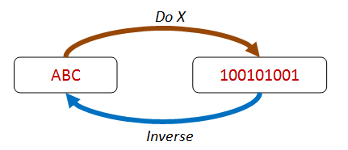
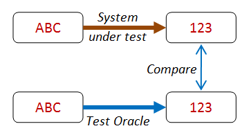

*UPDATE: I did a talk on property-based testing based on these posts. [Slides and video here.](/pbt/)*

In [the previous two posts](/posts/property-based-testing/), I described the basics of property-based testing, and showed how it can save a lot of time by generating random tests.

But here's a common problem. Everyone who sees a property-based testing tool like FsCheck or QuickCheck thinks that it is amazing... but
when it comes time to start creating your own properties, the universal complaint is: "what properties should I use? I can't think of any!"

The goal of this post is to show some common patterns that can help you discover the properties that are applicable to your code.

## Categories for properties

In my experience, many properties can be discovered by using one of the seven approaches listed below.

* ["Different paths, same destination"](#different-paths)
* ["There and back again"](#there-and-back)
* ["Some things never change"](#some-things-never-change)
* ["The more things change, the more they stay the same"](#idempotence)
* ["Solve a smaller problem first"](#structural-induction)
* ["Hard to prove, easy to verify"](#hard-to-prove-easy-to-verify)
* ["The test oracle"](#test-oracle)

This is by no means a comprehensive list, just the ones that have been most useful to me.
For a different perspective, check out [the list of patterns](http://research.microsoft.com/en-us/projects/pex/patterns.pdf) that the PEX team at Microsoft have compiled.



### "Different paths, same destination"

These kinds of properties are based on combining operations in different orders, but getting the same result.
For example, in the diagram below, doing `X` then `Y` gives the same result as doing `Y` followed by `X`.

In category theory, this is called a *commutative diagram*.

Addition is an obvious example of this pattern. For example, the result of `add 1` then `add 2` is the same as the result of `add 2` followed by `add 1`.

This pattern, generalized, can produce a wide range of useful properties. We'll see some more uses of this pattern later in this post.



### "There and back again"

These kinds of properties are based on combining an operation with its inverse, ending up with the same value you started with.

In the diagram below, doing `X` serializes `ABC` to some kind of binary format, and the inverse of `X` is some sort of deserialization that returns the same `ABC` value again.

In addition to serialization/deserialization, other pairs of operations can be checked this way: `addition`/`subtraction`, `write`/`read`, `setProperty`/`getProperty`, and so on.

Other pair of functions fit this pattern too, even though they are not strict inverses, pairs such as `insert`/`contains`, `create`/`exists` , etc.



### "Some things never change"

These kinds of properties are based on an invariant that is preserved after some transformation.

In the diagram below, the transform changes the order of the items, but the same four items are still present afterwards.

Common invariants include size of a collection (for `map` say), the contents of a collection (for `sort` say), the height or depth of something in proportion to size (e.g. balanced trees).



### "The more things change, the more they stay the same"

These kinds of properties are based on "idempotence" -- that is, doing an operation twice is the same as doing it once.

In the diagram below, using `distinct` to filter the set returns two items, but doing `distinct` twice returns the same set again.

Idempotence properties are very useful, and can be extended to things like database updates and message processing.



### "Solve a smaller problem first"

These kinds of properties are based on "structural induction" -- that is, if a large thing can be broken into smaller parts,
and some property is true for these smaller parts, then you can often  prove that the property is true for a large thing as well.

In the diagram below, we can see that the four-item list can be partitioned into an item plus a three-item list, which in turn can be
partitioned into an item plus a two-item list. If we can prove the property holds for two-item list, then we can infer that it holds for the three-item list, and for the four-item list as well.

Induction properties are often naturally applicable to recursive structures such as lists and trees.



### "Hard to prove, easy to verify"

Often an algorithm to find a result can be complicated, but verifying the answer is easy.

In the diagram below, we can see that finding a route through a maze is hard, but checking that it works is trivial!

Many famous problems are of this sort, such as prime number factorization. But this approach can be used for even simple problems.

For example, you might check that a string tokenizer works by just concatenating all the tokens again. The resulting string should be the same as what you started with.



### "The test oracle"

In many situations you often have an alternate version of an algorithm or process (a "test oracle") that you can use to check your results.

For example, you might have a high-performance algorithm with optimization tweaks that you want to test. In this case,
you might compare it with a brute force algorithm that is much slower but is also much easier to write correctly.

Similarly, you might compare the result of a parallel or concurrent algorithm with the result of a linear, single thread version.

## "Model-based" testing

"Model-based" testing, which we will discuss in more detail in a later post, is a variant on having a test oracle.

The way it works is that, in parallel with your (complex) system under test, you create a simplified model.

Then, when you do something to the system under test, you do the same (but simplified) thing to your model.

At the end, you compare your model's state with the state of the system under test. If they are the same, you're done. If not, either your SUT is buggy or your model is wrong and you have to start over!

## Summary

So that covers some of the common ways of thinking about properties.

Here are the seven ways again, along with a more formal term, if available.

* "Different paths, same destination" -- a diagram that commutes
* "There and back again" -- an invertible function
* "Some things never change" -- an invariant under transformation
* "The more things change, the more they stay the same" -- idempotence
* "Solve a smaller problem first" -- structural induction
* "Hard to prove, easy to verify"
* "A test oracle"

So that's the theory. How might we apply them in practice?
[In the next post, we'll look at some simple tasks](/posts/property-based-testing-3), such as "sort a list", "reverse a list", and so on, and see how we might test their implementations with these various approaches.

