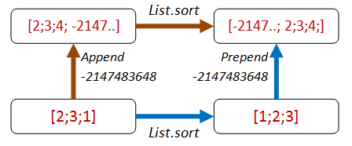

In [the previous post](/posts/property-based-testing-2/), we looked at some common patterns for finding properties. In this post, we'll apply these approaches to see if we can come up with properties for some simple functions such as "sort a list" and "reverse a list". As we work, we'll always being thinking about the Enterprise Developer From Hell ([see earlier post](/posts/property-based-testing/)) and how the EDFH could trick our tests into passing.

* ["Different paths, same destination"](#path_sort) applied to sorting a list 
* ["Different paths, same destination"](#path_rev) applied to reversing a list
* ["There and back again"](#inverseRev) applied to reversing a list
* ["Hard to prove, easy to verify"](#hardSplit) applied to splitting a string
* ["Hard to prove, easy to verify"](#hardList) applied to sorting a list 
* ["Some things never change"](#invariantSort). Invariants applied to sorting a list
* ["Solving a smaller problem"](#recurse) applied to sorting a list 
* ["The more things change, the more they stay the same"](#idempotent) applied to sorting a list 
* ["Two heads are better than one"](#oracle) applied to sorting a list 


## "Different paths, same destination" {#path_sort}

Let's start with *"different paths, same destination"* approach, or more formally, a "diagram that commutes", and apply it to a "sort" function.


Can we think of any way of combining an operation *before* `sort`, and another operation *after* `sort`,
so that you should end up with the same result?  That is, so that "going up then across the top" is the same as "going across the bottom then up".

How about this?

* **Path 1:** We add one to each element of the list, then sort.
* **Path 2:** We sort, then add one to each element of the list.
* Both lists should be equal.


Here's some code that implements that property. I've added an extra parameter `sortFn` so that I can pass in different implementations of the sort implementation to test them.

```fsharp {src=#path_sort1}
let addThenSort_eq_sortThenAdd sortFn aList =
  let add1 x = x + 1

  let result1 = aList |> sortFn |> List.map add1
  let result2 = aList |> List.map add1 |> sortFn
  result1 = result2
```

Now let's check this property with FsCheck, using a good implementation of the `sort` function

```fsharp {src=#path_sort1_check}
let goodSort = List.sort
Check.Quick (addThenSort_eq_sortThenAdd goodSort)
// Ok, passed 100 tests.
```

Well, that works, but it also would work for a lot of other transformations too.
For example, if the EDFH implemented `List.sort` as just the identity, then this property would be satisfied equally well! You can test this for yourself:

```fsharp {src=#path_sort1_checkbad}
let edfhSort1 aList = aList  // return the list unsorted!
Check.Quick (addThenSort_eq_sortThenAdd edfhSort1)
// Ok, passed 100 tests.
```

The problem with this property is that it is not exploiting any of the "sortedness". We know that a sort will probably reorder a list, and certainly, the smallest element should be first.

### Version 2

How about adding an item that we *know* will come at the front of the list after sorting?

* **Path 1:** We append `Int32.MinValue` to the *end* of the list, then sort.
* **Path 2:** We sort, then prepend `Int32.MinValue` to the *front* of the list.
* Both lists should be equal.



Here's the code:

```fsharp {src=#path_sort2}
let minValueThenSort_eq_sortThenMinValue sortFn aList =
  let minValue = Int32.MinValue

  let appendThenSort = 
    (aList @ [minValue]) |> sortFn
  let sortThenPrepend = 
    minValue :: (aList |> sortFn)
  appendThenSort = sortThenPrepend

// test
Check.Quick (minValueThenSort_eq_sortThenMinValue goodSort)
// Ok, passed 100 tests.
```

The EDFH implementation fails now!

```fsharp {src=#path_sort2_check_edfhSort1}
Check.Quick (minValueThenSort_eq_sortThenMinValue edfhSort1)
// Falsifiable, after 1 test (2 shrinks)
// [0]
```

In other words, the bad sort of `[0; minValue]` is *not* the same as `[minValue; 0]`.

So that's good!

But... we've got some hard coded things in there that the EDFH could take advantage of! The EDFH will not hesitate to exploit the fact that we always use `Int32.MinValue` and that we always prepend or append it to the test list.

In other words, the EDFH can identify which path we are on and have special cases for each one:

```fsharp {src=#path_sort2_edfhSort2}
// The Enterprise Developer From Hell strikes again
let edfhSort2 aList =
  match aList with
  | [] -> []
  | _ ->
    let head, tail = List.splitAt (aList.Length-1) aList
    let lastElem = tail.[0]
    // if the last element is Int32.MinValue, 
    // then move it to front
    if (lastElem = Int32.MinValue) then
      lastElem :: head
    else
      // otherwise, do not sort the list!
      aList 
```

And when we check it...

```fsharp {src=#path_sort2_edfhSort2_check}
// Oh dear, the bad implementation passes!
Check.Quick (minValueThenSort_eq_sortThenMinValue edfhSort2)
// Ok, passed 100 tests.
```

### Version 3

We could fix this by (a) picking a random number smaller than any number in the list and (b) inserting it at a random location rather than always appending it.
But rather than getting too complicated, let's stop and reconsider.

An alternative approach which also exploits the "sortedness" is to first negate all the values,
then on the path that negates *after* the sort, add an extra reverse as well.


```fsharp {src=#path_sort3}
let negateThenSort_eq_sortThenNegateThenReverse sortFn aList =
  let negate x = x * -1

  let negateThenSort = 
    aList |> List.map negate |> sortFn
  let sortThenNegateAndReverse = 
    aList |> sortFn |> List.map negate |> List.rev
  negateThenSort = sortThenNegateAndReverse
```

This property is harder for the EDFH to beat because there are no magic numbers to help identify which path you are on:

```fsharp {src=#path_sort3_check}
// test the good implementation
Check.Quick (negateThenSort_eq_sortThenNegateThenReverse goodSort)
// Ok, passed 100 tests.

// test the first EDFH sort
Check.Quick (negateThenSort_eq_sortThenNegateThenReverse edfhSort1)
// Falsifiable, after 1 test (1 shrinks)
// [1; 0]

// test the second EDFH sort
Check.Quick (negateThenSort_eq_sortThenNegateThenReverse edfhSort2)
// Falsifiable, after 5 tests (3 shrinks)
// [1; 0]
```

You might argue that we are only testing sorting for lists of integers. But the `List.sort` function is generic and knows nothing about integers per se, so I have high confidence that this property does test the core sorting logic.

If you have been paying attention though, there is a trivial implementation that the EDFH can use to beat this property: simply returning the empty list! We'll see how to deal with this later.

## Applying "different paths, same destination" to a list reversal function {#path_rev}

Ok, enough of `List.sort`. What about applying the same ideas to the list reversal function?

We can do the same append/prepend trick:


Here's the code for the property. Again, I've added an extra parameter `revFn` so that we can pass in different implementations.

```fsharp {src=#path_rev1}
let appendThenReverse_eq_reverseThenPrepend revFn anyValue aList =
  let appendThenReverse = 
    (aList @ [anyValue]) |> revFn
  let reverseThenPrepend = 
    anyValue :: (aList |> revFn)
  appendThenReverse = reverseThenPrepend
```

Here are the test results for the correct function and for two attempts by the EDFH to implement incorrect functions:

```fsharp {src=#path_rev1_check}
// Correct implementation suceeeds
let goodReverse = List.rev
Check.Quick (appendThenReverse_eq_reverseThenPrepend goodReverse)
// Ok, passed 100 tests.

// EDFH attempt #1 fails
let edfhReverse1 aList = []    // incorrect implementation
Check.Quick (appendThenReverse_eq_reverseThenPrepend edfhReverse1)
// Falsifiable, after 1 test (2 shrinks)
// true, []

// EDFH attempt #2 fails
let edfhReverse2 aList = aList  // incorrect implementation
Check.Quick (appendThenReverse_eq_reverseThenPrepend edfhReverse2)
// Falsifiable, after 1 test (1 shrinks)
// true, [false]
```

You might notice something interesting here.  I never specified the type of the list. The property works with *any* list.

In cases like these, FsCheck will generate random lists of bools, strings, ints, etc.

In both failing cases, the `anyValue` is a bool. So FsCheck is using lists of bools to start with.

Here's an exercise for you: Is this property good enough? Is there some way that the EDFH can create an implementation that will pass?

## "There and back again" {#inverseRev}

Sometimes the multi-path style properties are not available or too complicated, so let's move on to another approach: inverses.

Let's work with list sorting again. Is there an inverse to sorting? Hmmm, not really. So we'll skip sorting for now.

What about list reversal?  Well, as it happens, reversal is its own inverse!


Let's turn that into a property:

```fsharp {src=#inverseRev}
let reverseThenReverse_eq_original revFn aList =
  let reverseThenReverse = aList |> revFn |> revFn
  reverseThenReverse = aList
```

And it passes:

```fsharp {src=#inverseRev_check1}
let goodReverse = List.rev  // correct implementation
Check.Quick (reverseThenReverse_eq_original goodReverse)
// Ok, passed 100 tests.
```

Unfortunately, a bad implementation satisfies the property too!

```fsharp {src=#inverseRev_check2}
let edfhReverse aList = aList  // incorrect implementation
Check.Quick (reverseThenReverse_eq_original edfhReverse)
// Ok, passed 100 tests.
```

Nevertheless, the use of properties involving inverses can be very useful, most often to verify that pairs of functions (such as serialization/deserialization) are implemented correctly.

We'll see some real examples of using this in the next post.

## "Hard to prove, easy to verify" {#hardSplit}


So far we've been testing properties without actually caring about the end result of an operation.

But of course in practice, we do care about the end result!

Now, we normally can't prove that the internals of an implementation are correct without duplicating the function under test. But often we can determine that the *output* is correct quite easily.  In the maze diagram below, we don't don't have to know how the path-finding algorithm is implemented -- we can easily check whether the path works or not.


If we are looking for the *shortest* path, we might not be able to check it, but at least we know that we have *some* valid path.

This principle can be applied quite generally.

For example, let's say that we want to check whether a `stringSplit` function is working. 

```fsharp {src=#hardConcat1}
let stringSplit (str:string) : string list = ...
```

We don't have to write a tokenizer -- all we have to do is ensure that the tokens that are the output of `stringSplit`, when concatenated, give us back the original string.


Here's the core code from that property:

```fsharp {src=#hardConcat2}
let tokens = stringSplit inputString 

// build a string from the tokens
let recombinedString = tokens |> String.concat ","

// compare with the original 
inputString = recombinedString
```

But how can we create an original string? The random strings generated by FsCheck are unlikely to contain many commas!

There are ways that you can control exactly how FsCheck generates random data, which we'll look at later.

For now though, we'll use a trick. The trick is to let FsCheck generate a list of random strings, and then we'll build an `originalString` from them by concatting them together.

So here's the complete code for the property:

```fsharp {src=#hardConcat3}
let concatElementsOfSplitString_eq_originalString (strings:string list) =
  // make a string
  let inputString = strings |> String.concat ","

  // use the 'split' function on the inputString 
  let tokens = stringSplit inputString 

  // build a string from the tokens
  let recombinedString = tokens |> String.concat ","

  // compare the result with the original
  inputString = recombinedString
```

When we test this we are happy:

```fsharp {src=#hardConcat4}
Check.Quick concatElementsOfSplitString_eq_originalString
// Ok, passed 100 tests.
```

## "Hard to prove, easy to verify" for list sorting {#hardList}

So how can we apply this principle to a sorted list?  What property is easy to verify?

The first thing that pops into my mind is that for each pair of elements in the list, the first one will be smaller than the second.


So let's make that into a property:

```fsharp {src=#hardList1}
let adjacentPairsAreOrdered sortFn aList =
  let pairs = aList |> sortFn |> Seq.pairwise
  pairs |> Seq.forall (fun (x,y) -> x <= y )
```

Now let's check it:

```fsharp {src=#hardList1_check}
let goodSort = List.sort
Check.Quick (adjacentPairsAreOrdered goodSort)
```

But something funny happens when we execute the code above. We get an error!

```text {src=#hardList1_out}
System.Exception: The type System.IComparable is not 
  handled automatically by FsCheck
```

The exception means that FsCheck is trying to generate a random list, but all it knows is that the elements must be `IComparable`. Now `IComparable<int>` or `IComparable<string>` are concrete types, but `IComparable` on its own is not, and so FsCheck throws an error. 

How can we prevent this from happening? The solution is to specify a particular concrete type for the property, such as `int list`, like this:

```fsharp {src=#hardList2}
let adjacentPairsAreOrdered sortFn (aList:int list) =
  let pairs = aList |> sortFn |> Seq.pairwise
  pairs |> Seq.forall (fun (x,y) -> x <= y )
```

This code works now.

```fsharp {src=#hardList2_check}
let goodSort = List.sort
Check.Quick (adjacentPairsAreOrdered goodSort)
// Ok, passed 100 tests.
```

Note that even though the property has been constrained, the property is still a very general one. We could have used `string list` instead, for example, and it would work just the same.

```fsharp {src=#hardList3}
let adjacentPairsAreOrdered sortFn (aList:string list) =
  let pairs = aList |> sortFn |> Seq.pairwise
  pairs |> Seq.forall (fun (x,y) -> x <= y )

Check.Quick (adjacentPairsAreOrdered goodSort)
// Ok, passed 100 tests.
```


**Tip**: If FsCheck throws "type not handled", add explicit type constraints to your property


Are we done now?  No! One problem with this property is that it doesn't catch malicious implementations by the EDFH.

```fsharp {src=#hardList4}
// EDFH implementation passes :(
let edfhSort aList = []

Check.Quick (adjacentPairsAreOrdered edfhSort )
// Ok, passed 100 tests.
```

Is it a surprise to you that a silly implementation also works?

Hmmm. That tells us that there must be some property *other than pairwise ordering* associated with sorting that we've overlooked. What are we missing here?

This is a good example of how doing property-based testing can lead to insights about design.  We thought we knew what sorting meant, but we're being forced to be a bit stricter in our definition.

As it happens, we'll fix this particular problem by using the next principle!

## "Some things never change" {#invariantSort}

A useful kind of property is based on an invariant that is preserved after some transformation, such as preserving length or contents. These properties are not normally sufficient in themselves to ensure a correct implementation, but they *do* often act as a counter-check to more general properties.

For example, in [an earlier post](/posts/property-based-testing/), we created commutative and associative properties for addition, but then noticed that simply having an implementation that returned zero would satisfy them just as well!  It was only when we added `x + 0 = x` as a property that we could eliminate that particular malicious implementation.

And in the "list sort" example above, we could satisfy the "pairwise ordered" property with a function that just returned an empty list!  How could we fix that?

Our first attempt might be to check the length of the sorted list. If the lengths are different, then the sort function obviously cheated!

```fsharp {src=#invariant1}
let sortedHasSameLengthAsOriginal sortFn (aList:int list) =
  let sorted = aList |> sortFn
  List.length sorted = List.length aList
```

We check it and it works:

```fsharp {src=#invariant1_check1}
let goodSort = List.sort
Check.Quick (sortedHasSameLengthAsOriginal goodSort )
// Ok, passed 100 tests.
```

And yes, the EDFH implementation fails:

```fsharp {src=#invariant1_check2}
let edfhSort aList = []
Check.Quick (sortedHasSameLengthAsOriginal edfhSort)
// Falsifiable, after 1 test (1 shrink)
// [0]
```

Unfortunately, the EDFH is not defeated and can come up with another compliant implementation! Just repeat the first element N times!

```fsharp {src=#invariant2}
// EDFH implementation has same length as original
let edfhSort2 aList =
  match aList with
  | [] -> 
    []
  | head::_ -> 
    List.replicate (List.length aList) head

// for example
// edfhSort2 [1;2;3]  // => [1;1;1]
```

Now when we test this, it passes:

```fsharp {src=#invariant2_check1}
Check.Quick (sortedHasSameLengthAsOriginal edfhSort2 )
// Ok, passed 100 tests.
```

What's more, it also satisfies the pairwise ordering property too!

```fsharp {src=#invariant2_check2}
Check.Quick (adjacentPairsAreOrdered edfhSort2)
// Ok, passed 100 tests.
```

We will have to try again!

### Sort invariant - 2nd attempt

To help us come up with a useful property, let's compare the real result `[1;2;3]` and the EDFH's fake result `[1;1;1]`?

We can see that the fake result is throwing away data. The real result always contains the same contents as the original list, but just in a different order.


That leads us to a new property: a sorted list is always a permutation of the original list. Aha! Let's write the property in terms of permutations now:

```fsharp {src=#sortinvariant1}
let sortedListIsPermutationOfOriginal sortFn (aList:int list) =
  let sorted = aList |> sortFn
  let permutationsOfOriginalList = permute aList

  // the sorted list must be in the set of permutations
  permutationsOfOriginalList
  |> Seq.exists (fun permutation -> permutation = sorted)
```

Great, now all we need is a permutation function.

Let's head over to StackOverflow and ~~steal~~ [borrow an implementation](https://stackoverflow.com/a/3129136/1136133). Here it is:

```fsharp {src=#insertElement}
/// given aList and anElement to insert,
/// generate all possible lists with anElement
/// inserted into aList
let rec distribute e list = 
  match list with 
  | [] -> [[e]]
  | x::xs' as xs -> (e::xs)::[for xs in distribute e xs' -> x::xs]

/// Given a list, return all permutations of it
let rec permute list = 
  match list with 
  | [] -> [[]]
  | e::xs -> List.collect (distribute e) (permute xs)
```

Some quick interactive tests confirm that it works as expected:

```fsharp {src=#permutations_out}
permute [1;2;3] |> Seq.toList
//  [[1; 2; 3]; [2; 1; 3]; [2; 3; 1]; 
//   [1; 3; 2]; [3; 1; 2]; [3; 2; 1]]

permute [1;2;3;4] |> Seq.toList
// [[1; 2; 3; 4]; [2; 1; 3; 4]; [2; 3; 1; 4]; [2; 3; 4; 1]; [1; 3; 2; 4];
//  [3; 1; 2; 4]; [3; 2; 1; 4]; [3; 2; 4; 1]; [1; 3; 4; 2]; [3; 1; 4; 2];
//  [3; 4; 1; 2]; [3; 4; 2; 1]; [1; 2; 4; 3]; [2; 1; 4; 3]; [2; 4; 1; 3];
//  [2; 4; 3; 1]; [1; 4; 2; 3]; [4; 1; 2; 3]; [4; 2; 1; 3]; [4; 2; 3; 1];
//  [1; 4; 3; 2]; [4; 1; 3; 2]; [4; 3; 1; 2]; [4; 3; 2; 1]]

permute [3;3] |> Seq.toList
//  [[3; 3]; [3; 3]]
```

Excellent! Now let's run FsCheck:

```fsharp {src=#sortinvariant1_check}
Check.Quick (sortedListIsPermutationOfOriginal goodSort)
```

Hmmm. That's funny, nothing seems to be happening. And my CPU is maxing out for some reason. What's going on?

What's going on is that you are going to be sitting there for a long time! If you are following along at home, I suggest you right-click and cancel the interactive session now.

The innocent looking `permute` is really *really* slow for any normal sized list.
For example, a list of just 10 items has 3,628,800 permutations. While with 20 items, you are getting to astronomical numbers.


**Tip #1**: Think before coding! Be very wary of anything involving permutations!


We've already seen that even in the best case, FsCheck will evaluate the property 100 times. And if shrinking is needed, even more. So make sure your tests are fast to run!



**Tip #2**: Make sure your property checks are very fast. You will be running them a LOT!


But what happens if you are dealing with real systems such as databases, networks, or other slow dependencies?

In his (highly recommended) [video on using QuickCheck](http://vimeo.com/68383317), John Hughes tells of
when his team was trying to detect flaws in a distributed data store that could be caused by network partitions and node failures.

Of course, killing real nodes thousands of times was too slow, so they extracted the core logic into a virtual model, and tested that instead. As a result, the code was *later refactored* to make this kind of testing easier.  In other words, property-based testing influenced the design of the code, just as TDD would.


### Sort invariant - 3rd attempt

Ok, so we can't use permutations by just looping through them. So let's use the same idea but write a function that is specific for this case, a `isPermutationOf` function.

```fsharp {src=#sortinvariant2}
let sortedListIsPermutationOfOriginal sortFn (aList:int list) =
  let sorted = aList |> sortFn
  isPermutationOf aList sorted
```

An easy way to check whether two lists are permutations of each other is to sort them
and then compare them. But -- oops! -- we're trying to implement sort! So we can't use that.

Instead, we need to write a custom `isPermutationOf` function (shown below). It's more complicated,
but it doesn't rely on an existing implementation of `sort`.


```fsharp {src=#isPermutationOf}
/// Given an element and a list, and other elements previously skipped,
/// return a new list without the specified element.
/// If not found, return None

/// Given an element and a list, return a new list 
/// without the first instance of the specified element.
/// If element is not found, return None
let withoutElement x aList =
  let folder (acc,found) elem =
    if elem = x && not found then
      acc, true  // start skipping
    else
      (elem::acc), found // accumulate

  let (filteredList,found) = 
    aList |> List.fold folder ([],false)
  if found then
    filteredList |> List.rev |> Some
  else
    None


/// Given two lists, return true if they have the same contents
/// regardless of order
let rec isPermutationOf list1 list2 =
  match list1 with
  | [] -> List.isEmpty list2 // if both empty, true
  | h1::t1 ->
    match withoutElement h1 list2 with
    | None -> false
    | Some t2 -> isPermutationOf t1 t2
```

Let's try the test again. And yes, this time it completes before the heat death of the universe.

```fsharp {src=#sortinvariant2_check}
Check.Quick (sortedListIsPermutationOfOriginal goodSort)
// Ok, passed 100 tests.
```

What's also great is that the malicious EDFH implementations fail to satisfy this property!

```fsharp {src=#sortinvariant2_check2}
Check.Quick (sortedListIsPermutationOfOriginal edfhSort)
// Falsifiable, after 2 tests (4 shrinks) 
// [0]

Check.Quick (sortedListIsPermutationOfOriginal edfhSort2)
// Falsifiable, after 2 tests (5 shrinks)
// [1; 0]
```

In fact, these two properties, "adjacent pairs from a list should be ordered" and "a sorted list is a permultation of the original list" should indeed ensure that any implementation of `sort` is correct.

## Sidebar: Combining properties

Just above, we noted that there were *two* properties needed to define the "is sorted" property.  It would be nice if we could combine them into one property
`is sorted` so that we can have a single test.

Well, of course we can always merge the two sets of code into one function, but it's preferable to keep functions as small as possible.
Furthermore, a property like "is permutation of" might be reusable in other contexts as well.

What we want then, is an equivalent to `AND` and `OR` that is designed to work with properties.

FsCheck to the rescue! There are built in operators to combine properties: `.&.` for `AND` and `.|.` for `OR`.

Here is an example of them in use:

```fsharp {src=#combine1}
let listIsSorted sortFn (aList:int list) =
  let prop1 = adjacentPairsAreOrdered sortFn aList
  let prop2 = sortedListIsPermutationOfOriginal sortFn aList
  prop1 .&. prop2
```

When we test the combined property with a good implementation of `sort`, everything works as expected.

```fsharp {src=#combine2}
let goodSort = List.sort
Check.Quick (listIsSorted goodSort )
```

And if we test a bad implementation, the combined property fails as well.

```fsharp {src=#combine3}
let badSort aList = []
Check.Quick (listIsSorted badSort )
// Falsifiable, after 1 test (0 shrinks)
// [0]
```

But there's a problem now. Which of the two properties failed?

What we would like to do is add a "label" to each property so that we can tell them apart. In FsCheck, this is done with the `|@` operator:

```fsharp {src=#combine4}
let listIsSorted_labelled sortFn (aList:int list) =
  let prop1 = 
    adjacentPairsAreOrdered sortFn aList
    |@ "adjacent pairs from a list are ordered"
  let prop2 = 
    sortedListIsPermutationOfOriginal sortFn aList
    |@ "sorted list is a permutation of original list"
  prop1 .&. prop2
```

And now, when we test with the bad sort, we get a message `Label of failing property: a sorted list has same contents as the original list`:

```fsharp {src=#combine5}
Check.Quick (listIsSorted_labelled badSort )
//  Falsifiable, after 1 test (2 shrinks)
//  Label of failing property: 
//     sorted list is a permutation of original list
//  [0]
```

For more on these operators, [see the FsCheck documentation under "And, Or and Labels"](https://fscheck.github.io/FsCheck/Properties.html#And-Or-and-Labels).

And now, back to the property-devising strategies.

## "Solving a smaller problem" {#recurse}

Sometimes you have a recursive data structure or a recursive problem.  In these cases, you can often find a property that is true of a smaller part.

For example, for a sort, we could say something like:

```text {src=#list_recurse1}
A list is sorted if:
* The first element is smaller (or equal to) the second.
* The rest of the elements after the first element are also sorted.
```

Here is that logic expressed in code:

```fsharp {src=#list_recurse2}
let rec firstLessThanSecond_andTailIsSorted sortFn (aList:int list) =
  let sortedList = aList |> sortFn
  match sortedList with
  | [] -> true
  | [first] -> true
  | [first;second] -> first <= second
  | first::second::rest->
    first <= second &&
    let tail = second::rest
    // check that tail is sorted
    firstLessThanSecond_andTailIsSorted sortFn tail
```

This property is satisfied by the real sort function:

```fsharp {src=#list_recurse3}
let goodSort = List.sort
Check.Quick (firstLessThanSecond_andTailIsSorted goodSort )
// Ok, passed 100 tests.
```

But unfortunately, just like previous examples, the malicious implementations of the EDFH also pass.

```fsharp {src=#list_recurse4}
let efdhSort aList = []
Check.Quick (firstLessThanSecond_andTailIsSorted efdhSort)
// Ok, passed 100 tests.

let efdhSort2  aList =
  match aList with
  | [] -> []
  | head::_ -> List.replicate (List.length aList) head

Check.Quick (firstLessThanSecond_andTailIsSorted efdhSort2)
// Ok, passed 100 tests.
```

So as before, we'll need another property (such as the "is permutation of" invariant) to ensure that the code is correct.

If you do have a recursive data structure, then try looking for recursive properties. They are pretty obvious and low hanging, when you get the hang of it.


## "The more things change, the more they stay the same" {#idempotent}

Our next type of property is "idempotence".  Idempotence simply means that doing something twice is the same as doing it once. If I tell you to "sit down" and then tell you to "sit down" again, the second command has no effect.

Idempotence is [essential for reliable systems](https://queue.acm.org/detail.cfm?id=2187821)
and is [a key aspect of service oriented](http://soapatterns.org/design_patterns/idempotent_capability) and message-based architectures.

If you are designing these kinds of real-world systems it is well worth ensuring that your requests and processes are idempotent.

I won't go too much into this right now, but let's look at two simple examples.

First, our old friend `sort` is idempotent (ignoring stability) while `reverse` is not, obviously.

```fsharp {src=#idem_sort}
let sortTwice_eq_sortOnce sortFn (aList:int list) =
  let sortedOnce = aList |> sortFn
  let sortedTwice = aList |> sortFn |> sortFn
  sortedOnce = sortedTwice

// test
let goodSort = List.sort
Check.Quick (sortTwice_eq_sortOnce goodSort )
// Ok, passed 100 tests.
```

In general, any kind of query should be idempotent, or to put it another way: ["asking a question should not change the answer"](https://en.wikipedia.org/wiki/Command%E2%80%93query_separation).

In the real world, this may not be the case. A simple query on a datastore run at different times may give different results.

Here's a quick demonstration.

Here's an `IdempotentService` that always gives the same result for each query.

```fsharp {src=#idem_service1}
type IdempotentService() =
  let data = 0
  member this.Get() =
    data
```

And here's a `NonIdempotentService` that alters some internal state on each query. That is, if we ask the same question, we get a different answer each time.


```fsharp {src=#idem_service2}
type NonIdempotentService() =
  let mutable data = 0
  member this.Get() =
    data <- data + 1
    data
```

A property to check whether a function is idemponent might look like this:

```fsharp {src=#idem_service_prop}
let idempotentServiceGivesSameResult get =
  // first GET
  let get1 = get()

  // second GET 
  let get2 = get()
  get1 = get2
```

If we test with the first, idempotent service, it passes:

```fsharp {src=#idem_service1_check}
let service = IdempotentService()
let get() = service.Get()

Check.Quick (idempotentServiceGivesSameResult get)
// Ok, passed 100 tests.
```

But if we test with the non-idempotent service, it fails

```fsharp {src=#idem_service2_check}
let service = NonIdempotentService()
let get() = service.Get()

Check.Quick (idempotentServiceGivesSameResult get)
// Falsifiable, after 1 test
```

This non-idempotent service was trivial. In a more realistic example, the internal state might not be changed by the query, but by some other operation. But mutable state and concurrency do not play well together, and in this scenario it would be easy for the state to change (because some other process alters it) between calls to the same query. 


There are a number of ways to solve this problem. If you are building a REST GET handler or a database query service, and you want idempotence, you should consider using techniques such as etags, "as-of" times, date ranges, etc. Design techniques that make this easier include event sourcing, temporal databases, and so on. If you need tips on how to do this, searching for [idempotency patterns](http://blog.jonathanoliver.com/idempotency-patterns/) will turn up some good results.

## "Two heads are better than one" {#oracle}

And finally, last but not least, we come to the "test oracle". A test oracle is simply an alternative implementation that gives the right answer, and that you can check your results against.

Often the test oracle implementation is not suitable for production -- it's too slow, or it doesn't parallelize, or it's [too poetic](https://xkcd.com/1026/), etc., but that doesn't stop it being very useful for testing.

So for "list sort", there are many simple but slow implementations around. For example, here's a quick implementation of insertion sort:

```fsharp {src=#oracle1}
module InsertionSort =

  // Insert a new element into a list by looping over the list.
  // As soon as you find a larger element, insert in front of it
  let rec insert newElem list =
    match list with
    | head::tail when newElem > head ->
      head :: insert newElem tail
    | other -> // including empty list
      newElem :: other

  // Sorts a list by inserting the head into the rest of the list
  // after the rest have been sorted
  let rec sort list =
    match list with
    | []   -> []
    | head::tail ->
      insert head (sort tail)

  // test
  // sort  [5;3;2;1;1]
```

With this in place, we can write a property that tests our custom sort function against insertion sort.

```fsharp {src=#oracle2}
let customSort_eq_insertionSort sortFn (aList:int list) =
  let sorted1 = aList |> sortFn
  let sorted2 = aList |> InsertionSort.sort
  sorted1 = sorted2
```

When we test the good sort implementation, it works. Good!

```fsharp {src=#oracle2_check1}
let goodSort = List.sort
Check.Quick (customSort_eq_insertionSort goodSort)
// Ok, passed 100 tests.
```

And when we test a bad sort implementation, it doesn't. Even better!

```fsharp {src=#oracle2_check2}
let edfhSort aList = aList
Check.Quick (customSort_eq_insertionSort edfhSort)
// Falsifiable, after 4 tests (6 shrinks)
// [1; 0]
```

## Is the EDFH really a problem?

In this post, I've noted that trivial but wrong implementations often satisfy the properties as well as good implementations.

But should we *really* spend time worrying about this? I mean, if we ever really released a sort algorithm that just duplicated the first element it would be obvious immediately, surely?

So yes, it's true that truly malicious implementations are unlikely to be a problem. On the other hand, you should think of property-based testing not as a *testing* process, but as a *design* process -- a technique that helps you clarify what your system is really trying to do. And if a key aspect of your design is satisfied with just a simple implementation, then perhaps there is something you have overlooked -- something that, when you discover it, will make your design both clearer and more robust.


## Summary

In this post we looked at using the properties to test various list functions. But what about finding properties for other problems? In [the next post](/posts/property-based-testing-4) we will keep going and use the same techniques to test a different domain.




