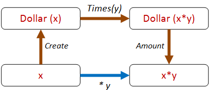
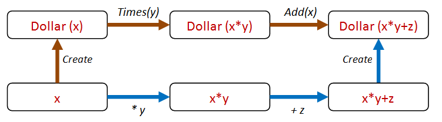

In [the previous](/posts/property-based-testing-4/) [two posts](/posts/property-based-testing-4/), we looked at applying property-based testing to lists and roman numerals. Now let's look at one more example problem, and see if we can find properties for it.

This sample is based on the well-known `Dollar` example described in Kent Beck's "TDD By Example" book. We're not going to attempt to critique the design itself and make it more type-driven -- [others have done that](http://spin.atomicobject.com/2014/12/10/typed-language-tdd-part2/).
Instead, we'll take the design as given and see what properties we can come up with.

So what do we have?

* A `Dollar` class that stores an `Amount`.
* Two methods `Add` and `Times` that transform the amount in the obvious way.

```fsharp {src=#dollar1a}
// OO style class with members
type Dollar(amount:int) =
  /// factory method
  static member Create amount  =
    Dollar amount
  /// field
  member val Amount = 
    amount with get, set
  /// Add to the amount
  member this.Add add =
    this.Amount <- this.Amount + add
  /// Multiply the amount
  member this.Times multiplier  =
    this.Amount <- this.Amount * multiplier
```

So, first let's try it out interactively to make sure it works as expected:

```fsharp {src=#dollar1b}
let d = Dollar.Create 2
d.Amount  // 2
d.Times 3
d.Amount  // 6
d.Add 1
d.Amount  // 7
```

## Testing the Dollar implementation

But that's just playing around, not real testing. So what kind of properties can we think of?

Let's run through them all again:

* Different paths to same result
* Inverses
* Invariants
* Idempotence
* Structural induction
* Easy to verify
* Test oracle

Let's skip the "different paths" one for now. What about inverses? Are there any inverses we can use?

Yes, the setter and getter form an inverse that we can create a property from:

```fsharp {src=#dollar1c}
let setThenGetShouldGiveSameResult value =
  let obj = Dollar.Create 0
  obj.Amount <- value
  let newValue = obj.Amount
  value = newValue

Check.Quick setThenGetShouldGiveSameResult
// Ok, passed 100 tests.
```

Idempotence is relevant too. For example, doing two sets in a row should be the same as doing just one. Here's a property for that:

```fsharp {src=#dollar1d}
let setIsIdempotent value =
  let obj = Dollar.Create 0
  obj.Amount <- value
  let afterFirstSet = obj.Amount
  obj.Amount <- value
  let afterSecondSet = obj.Amount
  afterFirstSet = afterSecondSet

Check.Quick setIsIdempotent 
// Ok, passed 100 tests.
```

Any "structural induction" properties?  No, not relevant to this case.

Any "easy to verify" properties? Not anything obvious.

Finally, is there a test oracle? No. Again not relevant, although if we really were designing a complex currency management system, it might be very useful to cross-check our results with a third party system.

## Properties for an immutable Dollar

A confession! I cheated a bit in the code above and created a mutable class, which is how most OO objects are designed. But in "TDD by Example" , Kent quickly realizes the problems with that and changes it to an immutable class, so let me do the same.

Here's the immutable version:

```fsharp {src=#dollar2a}
type Dollar(amount:int) =
  static member Create amount  =
    Dollar amount
  member val Amount = 
    amount
  member this.Add add =
    Dollar (amount + add)
  member this.Times multiplier  =
    Dollar (amount * multiplier)
```

and some interactive exploration:

```fsharp {src=#dollar2b}
let d1 = Dollar.Create 2
d1.Amount  // 2
let d2 = d1.Times 3
d2.Amount  // 6
let d3 = d2.Add 1
d3.Amount  // 7
```

What's nice about immutable code is that we can eliminate the need for testing of setters, so the two properties we just created have now become irrelevant!

To tell the truth they were pretty trivial anyway, so it's no great loss.

So then, what new properties can we devise now?

Let's look at the `Times` method. How can we test that? Which one of the strategies can we use?

I think the "different paths to same result" is very applicable. We can do the same thing we did with [sorting lists](/posts/property-based-testing-3) and do a times operation both "inside" and "outside" and see if they give the same result.


Here's that property expressed in code:

```fsharp {src=#dollar2c}
let createThenTimes_eq_timesThenCreate start multiplier =
  let d1 = Dollar.Create(start).Times(multiplier)
  let d2 = Dollar.Create(start * multiplier)
  d1 = d2
```

Great! Let's see if it works!

```fsharp {src=#dollar2c_check}
Check.Quick createThenTimes_eq_timesThenCreate
// Falsifiable, after 1 test
```

Oops -- it doesn't work!

Why not? Because we forgot that `Dollar` is a reference type and doesn't compare equal by default!

As a result of this mistake, we have discovered a property that we might have overlooked!
Let's encode that before we forget.

```fsharp {src=#dollar2d}
let dollarsWithSameAmountAreEqual amount =
  let d1 = Dollar.Create amount
  let d2 = Dollar.Create amount
  d1 = d2

Check.Quick dollarsWithSameAmountAreEqual 
// Falsifiable, after 1 test
```

So now we need to fix this by adding support for `IEquatable` and so on.

You can do that if you like -- I'm going to switch to F# record types and get equality for free!

## Dollar properties -- version 3

Here's the `Dollar` rewritten using a F# record type with the same methods added to it:

```fsharp {src=#dollar3a}
type Dollar = {amount:int }
  with
  static member Create amount  =
    {amount = amount}
  member this.Add add =
    {amount = this.amount + add }
  member this.Times multiplier  =
    {amount = this.amount * multiplier }
```

And now our two properties are satisfied:

```fsharp {src=#dollar3b_check}
Check.Quick dollarsWithSameAmountAreEqual
// Ok, passed 100 tests.

Check.Quick createThenTimes_eq_timesThenCreate
// Ok, passed 100 tests.
```

We can extend this approach for different paths. For example, we can extract the amount and compare it directly, like this:



The code looks like this:

```fsharp {src=#dollar3c}
let createThenTimesThenGet_eq_times start multiplier =
  let d1 = Dollar.Create(start).Times(multiplier)
  let a1 = d1.amount
  let a2 = start * multiplier
  a1 = a2

Check.Quick createThenTimesThenGet_eq_times
// Ok, passed 100 tests.
```

And we can also include `Add` in the mix as well.

For example, we can do a `Times` followed by an `Add` via two different paths, like this:



And here's the code:

```fsharp {src=#dollar3d}
let createThenTimesThenAdd_eq_timesThenAddThenCreate start multiplier adder =
  let d1 = Dollar.Create(start).Times(multiplier).Add(adder)
  let directAmount = (start * multiplier) + adder
  let d2 = Dollar.Create directAmount
  d1 = d2

Check.Quick createThenTimesThenAdd_eq_timesThenAddThenCreate
// Ok, passed 100 tests.
```

So this "different paths, same result" approach is very fruitful, and we can generate *lots* of paths this way.

## Dollar properties -- version 4

Shall we call it done then?  I would say not!

We are beginning to get a whiff of a code smell. All this `(start * multiplier) + adder` code seems like a bit of duplicated logic, and could end up being brittle.

Can we abstract out some commonality that is present all these cases?

If we think about it, our logic is *really* just this:

* Transform the amount on the "inside" of the class in some way.
* Transform the amount on the "outside" of the class in the same way.
* Make sure that the results are the same.

But to test this, the `Dollar` class is going to have to support an arbitrary transform. By convention, this should be called `Map`.

Now all our tests can be reduced to this one single diagram:


Let's add a `Map` method to `Dollar`. And we can also rewrite `Times` and `Add` in terms of `Map`:

```fsharp {src=#dollar4a}
type Dollar = {amount:int }
  with
  static member Create amount  =
    {amount = amount}
  member this.Map f =
    {amount = f this.amount}
  member this.Times multiplier =
    this.Map (fun a -> a * multiplier)
  member this.Add adder =
    this.Map (fun a -> a + adder)
```

Now the code for our property looks like this:

```fsharp {src=#dollar4b}
let createThenMap_eq_mapThenCreate start f =
  let d1 = Dollar.Create(start).Map f
  let d2 = Dollar.Create(f start)
  d1 = d2
```

But how can we test it now? What functions should we pass in?

Don't worry! FsCheck has you covered! In cases like this, FsCheck will actually generate random functions for you too!

Try it -- it just works!

```fsharp {src=#dollar4b_check}
Check.Quick createThenMap_eq_mapThenCreate
// Ok, passed 100 tests.
```

Our new "map" property is much more general than the original property using "times", so we can eliminate the latter safely.

### Logging the function parameter

There's a little problem with the property as it stands. If you want to see what the function is that FsCheck is generating, then Verbose mode is not helpful.

```fsharp {src=#dollar4b_check2}
Check.Verbose createThenMap_eq_mapThenCreate
```

Using `Check.Verbose` as above gives the output:

```text {src=#dollar4b_check2_out}
0:
18
<fun:Invoke@3000>
1:
7
<fun:Invoke@3000>
-- etc
98:
47
<fun:Invoke@3000>
99:
36
<fun:Invoke@3000>
Ok, passed 100 tests.
```

We can't tell what the function values actually were.

However, you can tell FsCheck to show more useful information by wrapping your function in a special `F` case, like this:

```fsharp {src=#dollar4c}
let createThenMap_eq_mapThenCreate_v2 start (F (_,f)) =
  let d1 = Dollar.Create(start).Map f
  let d2 = Dollar.Create(f start)
  d1 = d2
```

And now when you use Verbose mode...

```fsharp {src=#dollar4c_check}
Check.Verbose createThenMap_eq_mapThenCreate_v2
```

... you get a detailed log of each function that was used:

```text {src=#dollar4c_check_out}
0:
0
{ 0->1 }
1:
0
{ 0->0 }
2:
2
{ 2->-2 }
-- etc
98:
-5
{ -5->-52 }
99:
10
{ 10->28 }
Ok, passed 100 tests.
```

Each `{ 2->-2 }`, `{ 10->28 }`, etc., represents the function that was used for that iteration.



## TDD vs. property-based testing

How does property-based testing (PBT) fit in with TDD? This is a common question, so let me quickly give you my take on it.

First off, TDD works with *specific examples*, while PBT works with *universal properties*.

As I said in the [first post in this series](/posts/property-based-testing), I think examples are useful as a way into a design, and can be a form of documentation. But in my opinion, relying *only* on example-based tests would be a mistake.

Property-based approaches have a number of advantages over example-based tests:

* Property-based tests are more general, and thus are less brittle.
* Property-based tests provide a better and more concise description of requirements than a bunch of examples.
* As a consequence, one property-based test can replace many, many, example-based tests.
* By generating random input, property-based tests often reveal issues that you have overlooked, such as dealing with nulls, missing data, divide by zero, negative numbers, etc.
* Property-based tests force you to think.
* Property-based tests force you to have a clean design.

These last two points are the most important for me. Programming is not a matter of writing lines of code, it is about creating a design that meets the requirements.

So, anything that helps you think deeply about the requirements and what can go wrong should be a key tool in your personal toolbox!

For example, in the Roman Numeral post earlier, we saw that accepting `int` was a bad idea (the code broke!). We had a quick fix, but really we should model the concept of a `PositiveInteger` in our domain, and then change our code to use that type rather than just an `int`.
This demonstrates how using PBT can actually improve your domain model, not just find bugs.

Similarly, introducing a `Map` method in the Dollar scenario not only made testing easier, but actually improved the usefulness of the Dollar API overall.

Stepping back to look at the big picture, though, TDD and property-based testing are not at all in conflict. They share the same goal of building correct programs, and both are really more about design  than coding (think "Test-driven *design*" rather than "Test-driven *development*").

## The end, at last

So that brings us to the end of a long series on property-based testing!
In the future, we'll look at how you can create custom generators that match your domain. But for now, it's time to stop.

I hope that you have discovered some useful approaches that you can take away and apply to your own code.



