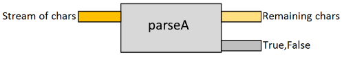
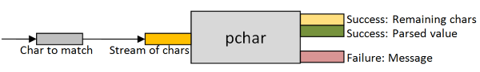

*UPDATE: [Slides and video from my talk on this topic](/parser/)*

In this series, we'll look at how so-called "applicative parsers" work. In order to understand something, there's nothing like building it for yourself, and so we'll create a basic parser library from scratch, and then some useful "parser combinators", and then finish off by building a complete JSON parser.

Now terms like "applicative parsers" and "parser combinators" can make this approach seem complicated, but rather than
attempting to explain these concepts up front, we'll just dive in and start coding.

We'll build up to the complex stuff incrementally via a series of implementations, where each implementation is only slightly different from the previous one. By using this approach, I hope that at each stage the design and concepts will be easy to understand, and so by the end of this series, parser combinators will have become completely demystified.

There will be four posts in this series:

* In this, the first post, we'll look at the basic concepts of parser combinators and build the core of the library.
* In the [second post](/posts/understanding-parser-combinators-2/), we'll build up a useful library of combinators.
* In the [third post](/posts/understanding-parser-combinators-3/), we'll work on providing helpful error messages.
* In the [last post](/posts/understanding-parser-combinators-4/), we'll build a JSON parser using this parser library.

Obviously, the focus here will not be on performance or efficiency, but I hope that it will give you the understanding that will then enable you to use libraries like [FParsec](http://www.quanttec.com/fparsec/) effectively. And by the way, a big thank you to Stephan Tolksdorf, who created FParsec. You should make it your first port of call for all your .NET parsing needs!

----

## Parsing a hard-coded character

To start with, let's create something that just parses a single, hard-coded, character, in this case, the letter "A". You can't get much simpler than that!

Here is how it works:

* The input to a parser is a stream of characters. We could use something complicated, but for now we'll just use a `string`.
* If the stream is empty, then return a pair consisting of `false` and an empty string.
* If the first character in the stream is an `A`, then return a pair consisting of `true` and the remaining stream of characters.
* If the first character in the stream is not an `A`, then return `false` and the (unchanged) original stream of characters.

Here's the code:

```fsharp {src=#aparser}
let parseA str =
  if String.IsNullOrEmpty(str) then
    (false,"")
  else if str.[0] = 'A' then
    let remaining = str.[1..]
    (true,remaining)
  else
    (false,str)
```

The signature of `parseA` is:

```fsharp {src=#aparser_sig}
val parseA :
  string -> (bool * string)
```

which tells us that the input is a string, and the output is a pair consisting of the boolean result and another string (the remaining input), like this:



Let's test it now -- first with good input:

```fsharp {src=#aparser_test}
let inputABC = "ABC"
parseA inputABC
```

The result is:

```fsharp {src=#aparser_test_out}
(true, "BC")
```

As you can see, the `A` has been consumed and the remaining input is just `"BC"`.

And now with bad input:

```fsharp {src=#aparser_test_bad}
let inputZBC = "ZBC"
parseA inputZBC
```

which gives the result:

```fsharp {src=#aparser_test_bad_out}
(false, "ZBC")
```

And in this case, the first character was *not* consumed and the remaining input is still `"ZBC"`.

So, there's an incredibly simple parser for you. If you understand that, then everything that follows will be easy!

----

## Parsing a specified character

Let's refactor so that we can pass in the character we want to match, rather than having it be hard coded.

And this time, rather than returning true or false, we'll return a message indicating what happened.

We'll call the function `pchar` for "parse char". This will become the fundamental building block of all our parsers. Here's the code for our first attempt:

```fsharp {src=#pchar_v1}
let pchar (charToMatch,str) =
  if String.IsNullOrEmpty(str) then
    let msg = "No more input"
    (msg,"")
  else
    let first = str.[0]
    if first = charToMatch then
      let remaining = str.[1..]
      let msg = sprintf "Found %c" charToMatch
      (msg,remaining)
    else
      let msg = sprintf "Expecting '%c'. Got '%c'" charToMatch first
      (msg,str)
```

This code is just like the previous example, except that the unexpected character is now shown in the error message.

The signature of `pchar` is:

```fsharp {src=#pchar_v1_sig}
val pchar :
  (char * string) -> (string * string)
```

which tells us that the input is a pair of (string,character to match) and the output is a pair consisting of the (string) result and another string (the remaining input).

Let's test it now -- first with good input:

```fsharp {src=#pchar_v1_test1}
let inputABC = "ABC"
pchar('A',inputABC)
```

The result is:

```fsharp {src=#pchar_v1_test1_out}
("Found A", "BC")
```

As before, the `A` has been consumed and the remaining input is just `"BC"`.

And now with bad input:

```fsharp {src=#pchar_v1_test2}
let inputZBC = "ZBC"
pchar('A',inputZBC)
```

which gives the result:

```fsharp {src=#pchar_v1_test2_out}
("Expecting 'A'. Got 'Z'", "ZBC")
```

And again, as before, the first character was *not* consumed and the remaining input is still `"ZBC"`.

If we pass in `Z`, then the parser does succeed:

```fsharp {src=#pchar_v1_test3}
pchar('Z',inputZBC)  // ("Found Z", "BC")
```


----

## Returning a Success/Failure

We want to be able to tell the difference between a successful match and a failure, and returning a stringly-typed message is not very helpful, so let's use a choice type (aka sum type, aka discriminated union) to indicate the difference. I'll call it `ParseResult`:

```fsharp {src=#ParseResult}
type ParseResult<'a> =
  | Success of 'a
  | Failure of string
```

The `Success` case is generic and can contain any value. The `Failure` case contains an error message.


For more on using this Success/Failure approach, see my talk on [functional error handling](/rop/).


We can now rewrite the parser to return one of the `Result` cases, like this:

```fsharp {src=#pchar_v2}
let pchar (charToMatch,str) =
  if String.IsNullOrEmpty(str) then
    Failure "No more input"
  else
    let first = str.[0]
    if first = charToMatch then
      let remaining = str.[1..]
      Success (charToMatch,remaining)
    else
      let msg = sprintf "Expecting '%c'. Got '%c'" charToMatch first
      Failure msg
```

The signature of `pchar` is now:

```fsharp {src=#pchar_v2_sig}
val pchar :
  (char * string) -> ParseResult<char * string>
```

which tells us that the the output is now a `ParseResult` (which in the `Success` case, contains the matched char and the remaining input string).

Let's test it again -- first with good input:

```fsharp {src=#pchar_v2_test1}
let inputABC = "ABC"
pchar('A',inputABC)
```

The result is:

```fsharp {src=#pchar_v2_test1_out}
Success ('A', "BC")
```

As before, the `A` has been consumed and the remaining input is just `"BC"`. We also get the *actual* matched char (`A` in this case).

And now with bad input:

```fsharp {src=#pchar_v2_test2}
let inputZBC = "ZBC"
pchar('A',inputZBC)
```

which gives the result:

```fsharp {src=#pchar_v2_test2_out}
Failure "Expecting 'A'. Got 'Z'"
```

And in this case, the `Failure` case is returned with the appropriate error message.

This is a diagram of the function's inputs and outputs now:


----

## Switching to a curried implementation

In the previous implementation, the input to the function has been a tuple -- a pair. This requires you to pass both inputs at once. In functional languages like F#, it's more idiomatic to use a curried version, like this:

```fsharp {src=#pchar_v3}
let pchar charToMatch str =
  if String.IsNullOrEmpty(str) then
    Failure "No more input"
  else
    let first = str.[0]
    if first = charToMatch then
      let remaining = str.[1..]
      Success (charToMatch,remaining)
    else
      let msg = sprintf "Expecting '%c'. Got '%c'" charToMatch first
      Failure msg
```

Can you see the difference?  The only difference is in the first line, and even then it is subtle.

Here's the uncurried (tuple) version:

```fsharp {src=#none}
let pchar (charToMatch,str) =
    ...
```

And here's the curried version:

```fsharp {src=#none}
let pchar charToMatch str =
    ...
```

The difference is much more obvious when you look at the type signatures.
Here's the signature for the uncurried (tuple) version:

```fsharp {src=#none}
val pchar :
    (char * string) -> Result<char * string>
//        ^ tuple
```

And here's the signature for the curried version:

```fsharp {src=#none}
val pchar :
    char -> string -> Result<char * string>
//        ^ curried
```

Here is the curried version of `pchar` represented as a diagram:



### What is currying?

If you are unclear on how currying works, I have a post about it [here](/posts/currying/), but basically it means that a multi-parameter function can be written as a series of one-parameter functions.

In other words, this two-parameter function:

```fsharp {src=#add_v1}
let add x y =
  x + y
```

which has the signature:

```fsharp {src=#add_v1_sig}
val add : x:int -> y:int -> int
```

can be written as an equivalent one-parameter function that returns a lambda, like this:

```fsharp {src=#add_v2}
let add x =
  fun y -> x + y  // return a lambda
```

or as a function that returns an inner function, like this:

```fsharp {src=#add_v3}
let add x =
  let innerFn y = x + y
  innerFn // return innerFn
```

In the second case, when an inner function is used, the signature looks slightly different:

```fsharp {src=#add_v3_sig}
val add : x:int -> (int -> int)
```

but the parentheses around the last parameter can be ignored. The signature, for all practical purposes, is the same as the original one:

```fsharp {src=#none}
// original (automatic currying of two parameter function)
val add : x:int -> y:int -> int

// explicit currying with inner function
val add : x:int -> (int -> int)
```

### Rewriting with an inner function

We can take advantage of currying and rewrite the parser as a one-parameter function (where the parameter is `charToMatch`) that returns a inner function.

Here's the new implementation, with the inner function cleverly named `innerFn`:

```fsharp {src=#pchar_v4}
let pchar charToMatch =
  // define a nested inner function
  let innerFn str =
    if String.IsNullOrEmpty(str) then
      Failure "No more input"
    else
      let first = str.[0]
      if first = charToMatch then
        let remaining = str.[1..]
        Success (charToMatch,remaining)
      else
        let msg = sprintf "Expecting '%c'. Got '%c'" charToMatch first
        Failure msg
  // return the inner function
  innerFn
```

The type signature for this implementation looks like this:

```fsharp {src=#pchar_v4_sig}
val pchar :
  charToMatch:char -> (string -> ParseResult<char * string>)
```

which is functionally equivalent to the signature of the previous version. In other words, both of the implementations below are *identical* from the callers point of view:

```fsharp {src=#none}
// two-parameter implementation
let pchar charToMatch str =
    ...

// one-parameter implementation with inner function
let pchar charToMatch =
    let innerFn str =
        ...
    // return the inner function
    innerFn
```


### The benefits of the curried implementation

What's nice about the curried implementation is that we can [partially apply](/posts/partial-application/) the character we want to parse, to get a new function, like this:

```fsharp {src=#parseA_curried}
let parseA = pchar 'A'
```

We can now supply the second "input stream" parameter later:

```fsharp {src=#parseA_curried2}
let inputABC = "ABC"
parseA inputABC  //=> Success ('A', "BC")

let inputZBC = "ZBC"
parseA inputZBC  //=> Failure "Expecting 'A'. Got 'Z'"
```

At this point, let's stop and review what is going on:

* The `pchar` function has two inputs
* We can provide one input (the char to match) and this results in a *function* being returned.
* We can then provide the second input (the stream of characters) to this parsing function, and this creates the final `Result` value.

Here's a diagram of `pchar` again, but this time with the emphasis on partial application:


It's very important that you understand this logic before moving on, because the rest of the post will build on this basic design.

----

## Encapsulating the parsing function in a type

If we look at `parseA` (from the example above) we can see that it has a function type:

```fsharp {src=#parseA_curried_sig}
val parseA : string -> ParseResult<char * string>
```

That type is a bit complicated to use, so let's encapsulate it in a "wrapper" type called `Parser`, like this:

```fsharp {src=#Parser}
type Parser<'T> = Parser of (string -> ParseResult<'T * string>)
```

By encapsulating it, we'll go from this design:


to this design, where it returns a `Parser` value:


What are the benefits of having this extra type, rather than working with the "raw" `string -> ParseResult` function directly?

* It's always good practice to use types to model the domain, and in this domain we are dealing with "parsers" not functions (even though they are the same thing behind the scenes).
* It makes the type inference easier and helps to make the parser combinators (that we will create later) more understandable (e.g. a combinator that takes two "Parser" parameters is clear, but a combinator taking two parameters of type `string -> ParseResult<'a * string>` is hard to read).
* Finally, it supports information hiding (via an abstract data type), so that we can later add metadata such as label/row/column, etc, without breaking any clients.

The change to the implementation is straightforward. We just need to change the way the inner function is returned.

That is, from this:

```fsharp {src=#none}
let pchar charToMatch =
    let innerFn str =
        ...
    // return the inner function
    innerFn
```

to this:

```fsharp {src=#none}
let pchar charToMatch =
    let innerFn str =
        ...
    // return the "wrapped" inner function
    Parser innerFn
```

### Testing the wrapped function

Ok, now let's test again:

```fsharp {src=#parseA_error}
let parseA = pchar 'A'
let inputABC = "ABC"
parseA inputABC  // compiler error
```

But now we get a compiler error:

```text {src=#parseA_error_text}
error FS0003: This value is not a function and cannot be applied.
```

And of course that is because the function is wrapped in the `Parser` data structure! It's not longer directly accessible.

So now we need a helper function that can extract the inner function and run it against the input stream. Let's call it `run`! Here's its implementation:

```fsharp {src=#run}
let run parser input =
  // unwrap parser to get inner function
  let (Parser innerFn) = parser
  // call inner function with input
  innerFn input
```

And now we can run the `parseA` parser against various inputs again:

```fsharp {src=#parseA_success}
let inputABC = "ABC"
run parseA inputABC  // Success ('A', "BC")

let inputZBC = "ZBC"
run parseA inputZBC  // Failure "Expecting 'A'. Got 'Z'"
```

That's it! We've got a basic `Parser` type! I hope that this all makes sense so far.

----

## Combining two parsers in sequence

That last implementation is good enough for basic parsing logic. We'll revisit it later,
but now let's move up a level and develop some ways of combining parsers together -- the "parser combinators" mentioned at the beginning.

We'll start with combining two parsers in sequence. For example, say that we want a parser that matches "A" and then "B". We could try writing something like this:

```fsharp {src=#parseAThenB_incorrect}
let parseA = pchar 'A'
let parseB = pchar 'B'

let parseAThenB = parseA >> parseB
```

but that gives us a compiler error, as the output of `parseA` does not match the input of `parseB`, and so they cannot be composed like that.

If you are familiar with [functional programming patterns](/fppatterns/), the need to chain a sequence of wrapped types together like this happens frequently, and the solution is a `bind` function.

However, in this case, I won't implement `bind` but will instead go straight to an `andThen` implementation.

The implementation logic will be as follows:

* Run the first parser.
* If there is a failure, return.
* Otherwise, run the second parser with the remaining input.
* If there is a failure, return.
* If both parsers succeed, return a pair (tuple) that contains both parsed values.

Here's the code for `andThen`:

```fsharp {src=#andThen}
let andThen parser1 parser2 =
  let innerFn input =
    // run parser1 with the input
    let result1 = run parser1 input

    // test the result for Failure/Success
    match result1 with
    | Failure err ->
      // return error from parser1
      Failure err

    | Success (value1,remaining1) ->
      // run parser2 with the remaining input
      let result2 =  run parser2 remaining1

      // test the result for Failure/Success
      match result2 with
      | Failure err ->
        // return error from parser2
        Failure err

      | Success (value2,remaining2) ->
        // combine both values as a pair
        let newValue = (value1,value2)
        // return remaining input after parser2
        Success (newValue,remaining2)

  // return the inner function
  Parser innerFn
```

The implementation follows the logic described above.

We'll also define an infix version of `andThen` so that we can use it like regular `>>` composition:

```fsharp {src=#andThenOp}
let ( .>>. ) = andThen
```

*Note: the parentheses are needed to define a custom operator, but are not needed in the infix usage.*

If we look at the signature of `andThen`:

```fsharp {src=#andThen_sig}
val andThen :
  parser1:Parser<'a> -> parser2:Parser<'b> -> Parser<'a * 'b>
```

we can see that it works for any two parsers, and they can be of different types (`'a` and `'b`).

### Testing "andThen"

Let's test it and see if it works!

First, create the compound parser:

```fsharp {src=#andThen_test1}
let parseA = pchar 'A'
let parseB = pchar 'B'
let parseAThenB = parseA .>>. parseB
```

If you look at the types, you can see that all three values have type `Parser`:

```fsharp {src=#andThen_test1_sig}
val parseA : Parser<char>
val parseB : Parser<char>
val parseAThenB : Parser<char * char>
```

`parseAThenB` is of type `Parser<char * char>` meaning that the parsed value is a pair of chars.

Now since the combined parser `parseAThenB` is just another `Parser`, we can use `run` with it as before.

```fsharp  {src=#andThen_test1_run}
run parseAThenB "ABC"  // Success (('A', 'B'), "C")
run parseAThenB "ZBC"  // Failure "Expecting 'A'. Got 'Z'"
run parseAThenB "AZC"  // Failure "Expecting 'B'. Got 'Z'"
```

You can see that in the success case, the pair `('A', 'B')` was returned, and also that failure
happens when either letter is missing from the input.


----

## Choosing between two parsers

Let's look at another important way of combining parsers -- the "or else" combinator.

For example, say that we want a parser that matches "A" *or* "B". How could we combine them?

The implementation logic would be:

* Run the first parser.
* On success, return the parsed value, along with the remaining input.
* Otherwise, on failure, run the second parser with the original input...
* ...and in this case, return the result (success or failure) from the second parser.

Here's the code for `orElse`:

```fsharp {src=#orElse}
let orElse parser1 parser2 =
  let innerFn input =
    // run parser1 with the input
    let result1 = run parser1 input

    // test the result for Failure/Success
    match result1 with
    | Success result ->
      // if success, return the original result
      result1

    | Failure err ->
      // if failed, run parser2 with the input
      let result2 = run parser2 input

      // return parser2's result
      result2

  // return the inner function
  Parser innerFn
```

And we'll define an infix version of `orElse` as well:

```fsharp {src=#orElseOp}
let ( <|> ) = orElse
```

If we look at the signature of `orElse`:

```fsharp {src=#orElse_sig}
val orElse :
  parser1:Parser<'a> -> parser2:Parser<'a> -> Parser<'a>
```

we can see that it works for any two parsers, but they must both be the *same* type `'a`.

### Testing "orElse"

Time to test it. First, create the combined parser:

```fsharp {src=#orElse_test}
let parseA = pchar 'A'
let parseB = pchar 'B'
let parseAOrElseB = parseA <|> parseB
```

If you look at the types, you can see that all three values have type `Parser<char>`:

```fsharp {src=#orElse_test_sig}
val parseA : Parser<char>
val parseB : Parser<char>
val parseAOrElseB : Parser<char>
```

Now if we run `parseAOrElseB` we can see that it successfully handles an "A" or a "B" as first character.

```fsharp {src=#orElse_test_run}
run parseAOrElseB "AZZ"  // Success ('A', "ZZ")
run parseAOrElseB "BZZ"  // Success ('B', "ZZ")
run parseAOrElseB "CZZ"  // Failure "Expecting 'B'. Got 'C'"
```

### Combining "andThen" and "orElse"

With these two basic combinators, we can build more complex ones, such as "A and then (B or C)".

Here's how to build up `aAndThenBorC` from simpler parsers:

```fsharp {src=#andThenOrElse_test}
let parseA = pchar 'A'
let parseB = pchar 'B'
let parseC = pchar 'C'
let bOrElseC = parseB <|> parseC
let aAndThenBorC = parseA .>>. bOrElseC
```

And here it is in action:

```fsharp {src=#andThenOrElse_run}
run aAndThenBorC "ABZ"  // Success (('A', 'B'), "Z")
run aAndThenBorC "ACZ"  // Success (('A', 'C'), "Z")
run aAndThenBorC "QBZ"  // Failure "Expecting 'A'. Got 'Q'"
run aAndThenBorC "AQZ"  // Failure "Expecting 'C'. Got 'Q'"
```

Note that the last example gives a misleading error. It says "Expecting 'C'" when it really should say "Expecting 'B' or 'C'".
We won't attempt to fix this right now, but in a later post we'll implement better error messages.

----

## Choosing from a list of parsers

This is where where the power of combinators starts kicking in, because with `orElse` in our toolbox, we can use it to build even more combinators. For example, let's say that we want choose from a *list* of parsers, rather than just two.

Well, that's easy. If we have a pairwise way of combining things, we can extend that to combining an entire list using `reduce` (for more on working with `reduce`, [see this post on monoids](/posts/monoids-without-tears/) ).

```fsharp {src=#choice}
/// Choose any of a list of parsers
let choice listOfParsers =
  List.reduce ( <|> ) listOfParsers
```

*Note that this will fail if the input list is empty, but we will ignore that for now.*

The signature of `choice` is:

```fsharp {src=#choice_sig}
val choice :
  Parser<'a> list -> Parser<'a>
```

which shows us that, as expected, the input is a list of parsers, and the output is a single parser.

With `choice` available, we can create an `anyOf` parser that matches any character in a list, using the following logic:

* The input is a list of characters
* Each char in the list is transformed into a parser for that char using `pchar`
* Finally, all the parsers are combined using `choice`

Here's the code:

```fsharp {src=#anyOf}
/// Choose any of a list of characters
let anyOf listOfChars =
  listOfChars
  |> List.map pchar // convert into parsers
  |> choice         // combine them
```

Let's test it by creating a parser for any lowercase character and any digit character:

```fsharp {src=#parseLowercase}
let parseLowercase =
  anyOf ['a'..'z']

let parseDigit =
  anyOf ['0'..'9']
```

If we test them, they work as expected:

```fsharp {src=#parseLowercase_run}
run parseLowercase "aBC"  // Success ('a', "BC")
run parseLowercase "ABC"  // Failure "Expecting 'z'. Got 'A'"

run parseDigit "1ABC"  // Success ("1", "ABC")
run parseDigit "9ABC"  // Success ("9", "ABC")
run parseDigit "|ABC"  // Failure "Expecting '9'. Got '|'"
```

Again, the error messages are misleading. Any lowercase letter can be expected, not just 'z', and any digit can be expected, not just '9'.
As I said earlier, we'll work on the error messages in a later post.

## Review

Let's stop for now, and review what we have done:

* We have created a type `Parser` that is a wrapper for a parsing function.
* The parsing function takes an input (e.g. string) and attempts to match the input using the criteria baked into the function.
* If the match succeeds, the parsing function returns a `Success` with the matched item and the remaining input.
* If the match fails, the parsing function returns a `Failure` with reason for the failure.
* And finally, we saw some "combinators" -- ways in which `Parser`s could be combined to make a new `Parser`: `andThen` and `orElse` and `choice`.

## Listing of the parser library so far

Here's the complete listing for the parsing library so far -- it's about 90 lines of code.



```fsharp {src=#ParserLibrary}
open System

/// Type that represents Success/Failure in parsing
type ParseResult<'a> =
  | Success of 'a
  | Failure of string

/// Type that wraps a parsing function
type Parser<'T> = Parser of (string -> ParseResult<'T * string>)

/// Parse a single character
let pchar charToMatch =
  // define a nested inner function
  let innerFn str =
    if String.IsNullOrEmpty(str) then
      Failure "No more input"
    else
      let first = str.[0]
      if first = charToMatch then
        let remaining = str.[1..]
        Success (charToMatch,remaining)
      else
        let msg = sprintf "Expecting '%c'. Got '%c'" charToMatch first
        Failure msg
  // return the "wrapped" inner function
  Parser innerFn

/// Run a parser with some input
let run parser input =
  // unwrap parser to get inner function
  let (Parser innerFn) = parser
  // call inner function with input
  innerFn input

/// Combine two parsers as "A andThen B"
let andThen parser1 parser2 =
  let innerFn input =
    // run parser1 with the input
    let result1 = run parser1 input

    // test the result for Failure/Success
    match result1 with
    | Failure err ->
      // return error from parser1
      Failure err

    | Success (value1,remaining1) ->
      // run parser2 with the remaining input
      let result2 =  run parser2 remaining1

      // test the result for Failure/Success
      match result2 with
      | Failure err ->
        // return error from parser2
        Failure err

      | Success (value2,remaining2) ->
        // combine both values as a pair
        let newValue = (value1,value2)
        // return remaining input after parser2
        Success (newValue,remaining2)

  // return the inner function
  Parser innerFn

/// Infix version of andThen
let ( .>>. ) = andThen

/// Combine two parsers as "A orElse B"
let orElse parser1 parser2 =
  let innerFn input =
    // run parser1 with the input
    let result1 = run parser1 input

    // test the result for Failure/Success
    match result1 with
    | Success result ->
      // if success, return the original result
      result1

    | Failure err ->
      // if failed, run parser2 with the input
      let result2 = run parser2 input

      // return parser2's result
      result2

  // return the inner function
  Parser innerFn

/// Infix version of orElse
let ( <|> ) = orElse

/// Choose any of a list of parsers
let choice listOfParsers =
  List.reduce ( <|> ) listOfParsers

/// Choose any of a list of characters
let anyOf listOfChars =
  listOfChars
  |> List.map pchar // convert into parsers
  |> choice
```


## Summary

In this post, we have created the foundations of a parsing library, and few simple combinators.

In the [next post](/posts/understanding-parser-combinators-2/), we'll build on this to create a library with many more combinators.


## Further information

* If you are interesting in using this technique in production, be sure to investigate the [FParsec library](http://www.quanttec.com/fparsec/) for F#,
which is optimized for real-world usage.
* For more information about parser combinators in general, search the internet for "Parsec", the Haskell library that influenced FParsec (and this post).
* For some examples of using FParsec, try one of these posts:
  * [Implementing a phrase search query for FogCreek's Kiln](https://web.archive.org/web/20130425230031/http://blog.fogcreek.com/fparsec/)
  * [A LOGO Parser](http://trelford.com/blog/post/FParsec.aspx)
  * [A Small Basic Parser](http://trelford.com/blog/post/parser.aspx)
  * [A C# Parser](http://trelford.com/blog/post/parsecsharp.aspx) and [building a C# compiler in F#](https://neildanson.wordpress.com/2014/02/11/building-a-c-compiler-in-f/)
  * [Write Yourself a Scheme in 48 Hours in F#](https://lucabolognese.wordpress.com/2011/08/05/write-yourself-a-scheme-in-48-hours-in-f-part-vi/)
  * [Parsing GLSL, the shading language of OpenGL](http://laurent.le-brun.eu/site/index.php/2010/06/07/54-fsharp-and-fparsec-a-glsl-parser-example)





