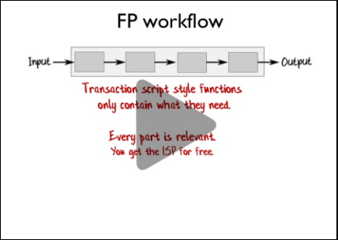

This page contains links to the slides and code from my talk "Reinventing the Transaction Script".

Here's the blurb for the talk:

> The Transaction Script pattern organizes business logic as a single procedure. It has always
> been considered less sophisticated and flexible than a layered architecture with a rich
> domain model. But is that really true?
> \
> \
> In this talk, we'll reinvent the Transaction Script using functional programming principles.
> We'll see that we can still do domain-driven design, and still have code which is decoupled
> and reusable, all while preserving the simplicity and productivity of the original
> one-script-per-workflow approach.

## Videos

Video from NDC London, Jan 2020.

## Slides

Slides from NDC London, Jan 2020.



