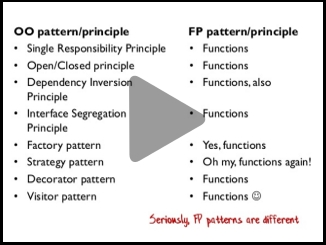
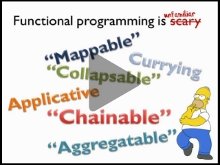
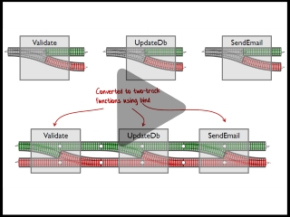
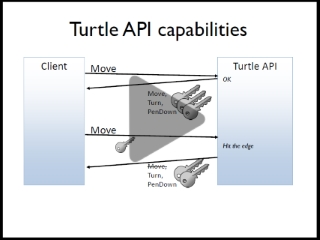
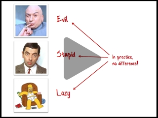
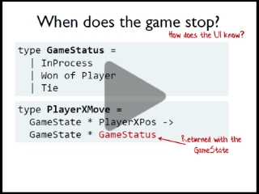
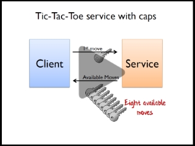
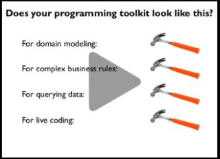
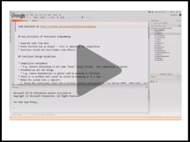

Like to watch videos? You're in the right place!

This page lists all my talks that are available on video. Each talk is about one hour long.
Slides and more information are also available for each talk -- see the link at the end of each description.

For more F# videos, visit the [Community for F#](http://c4fsharp.net/#online-presentations) site.

------





## Functional Design Patterns

In object-oriented development, we are all familiar with design patterns
such as the Strategy pattern and Decorator pattern, and design principles such as SOLID.

The functional programming community has design patterns and principles as well.

This talk provides an overview of some of these, and presents some
demonstrations of FP design in practice. **Over [100,000 views on YouTube](https://www.youtube.com/watch?v=E8I19uA-wGY)!**

[Slides and more information](../fppatterns/)





------





## Domain Modeling Made Functional

Statically typed functional programming languages like F# encourage a very different way of thinking about types.
The type system is your friend, not an annoyance, and can be used in many ways that might not be familiar to OO programmers.

Types can be used to represent the domain in a fine-grained, self documenting way. And in many cases,
types can even be used to encode business rules so that you literally cannot create incorrect code.
You can then use the static type checking almost as an instant unit test -- making sure that your code is correct at compile time.

In this talk, we'll look at some of the ways you can use types as part of a domain driven design process,
with some simple real world examples in F#. No jargon, no maths, and no prior F# experience necessary.

[Slides and more information](../ddd/)





------





## A functional approach to error handling *(Railway Oriented Programming)*

Many examples in functional programming assume that you are always on the "happy path".
But to create a robust real world application you must deal with validation, logging,
network and service errors, and other annoyances.

So, how do you handle all this in a clean functional way?

This talk will provide a brief introduction to this topic,
using a fun and easy-to-understand railway analogy.

[Slides and more information](../rop/)





------





## F# for C# Programmers

Curious about F# and want to understand how is it different from C#?

In this talk, we'll look at the basics of coding in F#, and how functional programming differs from object-oriented programming.
Along the way, there will be many examples showing the same code written in C# and F# so that you can see for yourself how the two languages differ in style and approach.

[Slides and more information](../csharp/)





------





## The Power of Composition

Composition is a fundamental principle of functional programming, but how is it different from an object-oriented approach, and how do you use it in practice?

In this talk for beginners, we'll start by going over the basic concepts of functional programming, and then look at some different ways that composition can be used to build large things from small things.

After that, we'll see how composition is used in practice, beginning with a simple FizzBuzz example, and ending with a complete (object-free!) web application.

[Slides and more information](../composition/)





------





## Understanding parser combinators

Traditionally, writing parsers has been hard, involving arcane tools like Lex and Yacc.
An alternative approach is to write a parser in your favourite programming language,
using a "parser combinator" library and concepts no more complicated than regular expressions.

In this talk, we'll do a deep dive into parser combinators.
We'll build a parser combinator library from scratch in F# using functional programming techniques,
and then use it to implement a full featured JSON parser.

[Slides and more information](../parser/)

This talk is based on my blog posts on this topic:

* [Understanding parser combinators](/series/understanding-parser-combinators/)





------





## Thirteen ways of looking at a turtle

In this fast-paced talk, I'll start with the well known API for turtle graphics, and then stretch
it to the breaking point by creating 13 different implementations, each demonstrating a different functional programming technique.

Along the way, we'll use partial application, functional dependency injection, validation
with Success/Failure results, the Either monad, the State monad, agents with message queues, event sourcing,
stream processing, capability-based design, and the interpreter pattern (aka free monad). Phew!

[Slides and more information](../turtle/)

This talk is based on my blog posts on this topic:

* [Thirteen ways of looking at a turtle](/posts/13-ways-of-looking-at-a-turtle/)





------





## Property-based testing

We are all familiar with example-based testing, as typified by TDD and BDD.
Property-based testing takes a very different approach, where a single test is run hundreds of times with randomly generated inputs.

Property-based testing is a great way to find edge cases, and also helps you to
understand and document the behaviour of your code under all conditions.

This talk will introduce property-based testing and show how it works,
and why you should consider adding it to your arsenal of testing tools.

[Slides and more information](../pbt/)

This talk is based on my blog posts on this topic:

* [An introduction to property-based testing](/posts/property-based-testing/)
* [Choosing properties for property-based testing](/posts/property-based-testing-2/)





------





## Dr Frankenfunctor and the Monadster

You've got a pile of assorted functions lying around. Each one is useful and reliable, but they just don't fit together properly.
How can you assemble them into a complete system that can stand on its own two feet and terrorize the local villagers?

In this session, I'll show how functional programming can transform all sorts of existing code into shapes that are plug-compatible and which can be bolted together effortlessly.

[Slides and more information](../monadster/)

This talk is based on my blog post on this topic:

* [Dr Frankenfunctor and the Monadster](/posts/monadster/)





------





## Enterprise Tic-Tac-Toe

Follow along as I ridiculously over-engineer a simple game to demonstrate how
functional programming can be used to create a real-world "enterprise-ready" application.

Topics covered include: encoding business rules into types, data hiding with parametric polymorphism,
using functions for capability-based security, exposing a REST API with
HATEAOS, the functional approach to logging, actors, scalability and more.

[Slides and more information](../ettt/)

This talk is based on my blog posts on this topic:

* [Enterprise Tic-Tac-Toe](/posts/enterprise-tic-tac-toe/)
* [Enterprise Tic-Tac-Toe Part 2, In which I throw away the previous design](/posts/enterprise-tic-tac-toe-2/)





------





## Designing with Capabilities

We all want to produce modular and robust code that is easy to test and refactor,
and we have design principles such as SOLID that help us do that.

In this talk I'll look at a very different approach to design using "capabilities"
and the principle of least authority. I'll show how using these design techniques
throughout your core domain (and not just at your API boundary) also
leads to well-designed and modular code.

I'll demonstrate how to design and use a capability based approach,
how capabilities can be quickly combined and restricted easily,
and how capabilities are a natural fit with a REST API that uses HATEAOS.

[Slides and more information](../cap/)

This talk is based on my blog posts on this topic:

* [A functional approach to authorization](/posts/capability-based-security/)
* [Constraining capabilities based on identity and role](/posts/capability-based-security-2/)
* [Using types as access tokens](/posts/capability-based-security-3/)





------





## Four Languages From Forty Years Ago

The 1970's were a golden age for new programming languages, but do they have any relevance to programming today? Can we still learn from them?

In this talk, we'll look at four languages designed over forty years ago -- SQL, Prolog, ML, and Smalltalk -- and discuss their philosophy and approach to programming, which is very different from most popular languages today.

We'll come away with some practical principles that are still very applicable to modern development. And you might discover your new favorite programming paradigm!

[Slides and more information](../fourfromforty/)





------





## The Functional Programmer's Toolkit

The functional programming community has a number of patterns with strange names such as monads, monoids, functors, and catamorphisms.

In this beginner-friendly talk, we'll demystify these techniques and see how they all fit together into a small but versatile "tool kit".

We'll then see how the tools in this tool kit can be applied to a wide variety of programming problems, such as handling missing data, working with lists, and implementing the functional equivalent of dependency injection.

[Slides and more information](../fptoolkit/)





------





## Code Review/Refactor Live

In this live session for [Community for F#](http://c4fsharp.net/), I refactor some ugly code into something a bit cleaner and functional, to give viewers an insight into basic F# coding practices, and also show how to avoid some common code smells.

[GitHub repository with code samples is here](https://github.com/swlaschin/RefactoringFSharp).





