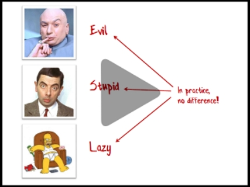

This page contains links to the slides and code from my talk "An introduction to property based testing". 

Here's the blurb for the talk:

> We are all familiar with example-based testing, as typified by TDD and BDD. 
> Property-based testing takes a very different approach, where a single test is run hundreds of times with randomly generated inputs. 
>   
> Property-based testing is a great way to find edge cases, and also helps you to 
> understand and document the behaviour of your code under all conditions. 
>   
> This talk will introduce property-based testing and show how it works, 
> and why you should consider adding it to your arsenal of testing tools. 

This talk is based on my blog posts on this topic:

* [An introduction to property-based testing](/posts/property-based-testing/)
* [Choosing properties for property-based testing](/posts/property-based-testing-2/)

## Video
 
(Click image to view video - free registration required) 

## Slides 

Slides from Functional Programming eXchange, Jun 11, 2015

<iframe src="//www.slideshare.net/slideshow/embed_code/key/bZOTmaGVvWyrVj" width="427" height="356" frameborder="0" marginwidth="0" marginheight="0" scrolling="no" style="border:1px solid #CCC; border-width:1px 1px 0; margin-bottom:5px; max-width: 100%;" allowfullscreen> </iframe> 

 
<strong><a href="https://www.slideshare.net/ScottWlaschin/an-introduction-to-property-based-testing" title="An introduction to property based testing" target="_blank">An introduction to property based testing</a> </strong> from <strong><a href="http://www.slideshare.net/ScottWlaschin" target="_blank">my slides on Slideshare</a></strong> 

  
  

## Further viewing

Here are some links to some other talks on property-based testing and functional testing in general. 

* [John Hughes: Race Conditions, Distribution, Interactions--Testing the Hard Stuff and Staying Sane](https://vimeo.com/68383317)
* [Jessica Kerr: Property-based Testing for Better Code](https://www.youtube.com/watch?v=shngiiBfD80)
* [Pluralsight course by Mark Seemann: Introduction to Property-based Testing with F#](http://www.pluralsight.com/courses/fsharp-property-based-testing-introduction)
* [Mark Seemann: Look, No Mocks! Functional TDD with F#](http://www.infoq.com/presentations/mock-fsharp-tdd)

There are lots and lots of other good ones as well -- just search the net for "property-based testing."

