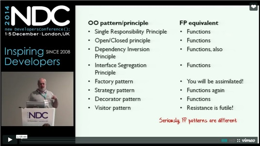
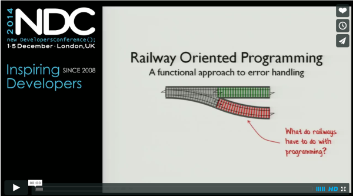
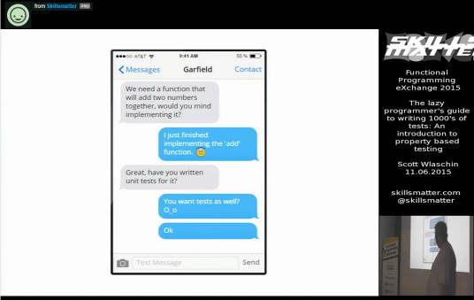
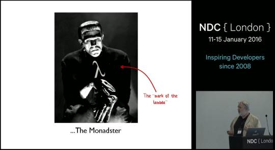
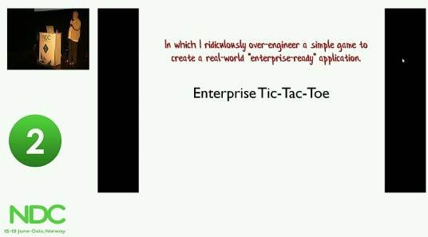
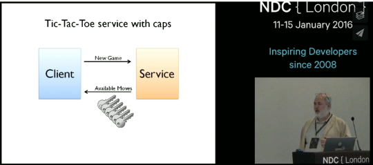
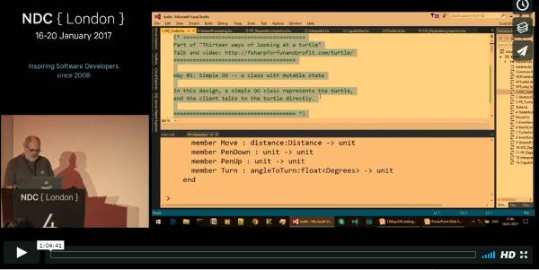

This page lists all the videos that I have available. 

Slides and more information are also available -- see the link at the end of each description.

And for more F# videos, visit the [Community for F#](http://c4fsharp.net/#online-presentations) site!

------

  

    

    <h2>Functional Design Patterns</h2>
    

    <blockquote>In object-oriented development, we are all familiar with design patterns
    such as the Strategy pattern and Decorator pattern, and design principles such as SOLID. 
      
    The functional programming community has design patterns and principles as well. 
      
    This talk provides an overview of some of these, and presents some 
    demonstrations of FP design in practice.</blockquote>
    

    

    <a href="../fppatterns/">Slides and more information</a>
    

	

    

    
	

    

------

  

    

    <h2>A functional approach to Domain Driven Design</h2>
    

    
    <blockquote>Statically typed functional programming languages like F# encourage a very different way of thinking about types.
    The type system is your friend, not an annoyance, and can be used in many ways that might not be familiar to OO programmers. 
      
    Types can be used to represent the domain in a fine-grained, self documenting way. And in many cases,
    types can even be used to encode business rules so that you literally cannot create incorrect code.
    You can then use the static type checking almost as an instant unit test -- making sure that your code is correct at compile time. 
      
    In this talk, we'll look at some of the ways you can use types as part of a domain driven design process,
    with some simple real world examples in F#. No jargon, no maths, and no prior F# experience necessary. </blockquote>
    

    

    <a href="../ddd/">Slides and more information</a>
    

	

    

    
	

    

------

  

    

    <h2>A functional approach to error handling</h2>
    <h3><i>(Railway Oriented Programming)</i></h3>
    

    <blockquote>Many examples in functional programming assume that you are always on the "happy path". 
But to create a robust real world application you must deal with validation, logging, 
network and service errors, and other annoyances. 
  
So, how do you handle all this in a clean functional way? 
  
This talk will provide a brief introduction to this topic, 
using a fun and easy-to-understand railway analogy.</blockquote>

    

    

    <a href="../rop/">Slides and more information</a>
    

	

    

    
	

    

------

  

    

    <h2>Property-based testing</h2>
    

<blockquote>We are all familiar with example-based testing, as typified by TDD and BDD. 
Property-based testing takes a very different approach, where a single test is run hundreds of times with randomly generated inputs. 
  
Property-based testing is a great way to find edge cases, and also helps you to 
understand and document the behaviour of your code under all conditions. 
  
This talk will introduce property-based testing and show how it works, 
and why you should consider adding it to your arsenal of testing tools.  </blockquote>

    

    

    <a href="../pbt/">Slides and more information</a>
    

    
    

This talk is based on my blog posts on this topic:
<ul>
<li><a href="/posts/property-based-testing/">An introduction to property-based testing</a></li>
<li><a href="/posts/property-based-testing-2/">Choosing properties for property-based testing</a></li>
</ul>
    

	

    

    
	

    

------

  

    

    <h2>Dr Frankenfunctor and the Monadster</h2>
    

    
<blockquote>You've got a pile of assorted functions lying around. Each one is useful and reliable, but they just don't fit together properly. 
How can you assemble them into a complete system that can stand on its own two feet and terrorize the local villagers?
  
In this session, I'll show how functional programming can transform all sorts of existing code into shapes that are plug-compatible and which can be bolted together effortlessly.
</blockquote>

    

    

    <a href="../monadster/">Slides and more information</a>
    

    
    

This talk is based on my blog posts on this topic:
<ul>
<li><a href="/posts/monadster/">Dr Frankenfunctor and the Monadster</a></li>
</ul>
    

	

    

    
	

    

------

  

    

    <h2>Enterprise Tic-Tac-Toe</h2>
    

 <blockquote>Follow along as I ridiculously over-engineer a simple game to demonstrate how 
functional programming can be used to create a real-world "enterprise-ready" application.
  
Topics covered include: encoding business rules into types, data hiding with parametric polymorphism, 
using functions for capability-based security, exposing a REST API with 
HATEAOS, the functional approach to logging, actors, scalability and more. </blockquote>
    

    

    <a href="../ettt/">Slides and more information</a>
    

    

This talk is based on my blog posts on this topic:
<ul>
<li><a href="/posts/enterprise-tic-tac-toe/">Enterprise Tic-Tac-Toe</a></li>
<li><a href="/posts/enterprise-tic-tac-toe-2/">Enterprise Tic-Tac-Toe Part 2, In which I throw away the previous design</a></li>
</ul>
    

	

    

    
	

    

------

  

    

    <h2>Designing with Capabilities</h2>
    

    
    
 <blockquote>We all want to produce modular and robust code that is easy to test and refactor, 
and we have design principles such as SOLID that help us do that.
  
In this talk I'll look at a very different approach to design using "capabilities" 
and the principle of least authority. I'll show how using these design techniques 
throughout your core domain (and not just at your API boundary) also 
leads to well-designed and modular code.
  
I'll demonstrate how to design and use a capability based approach, 
how capabilities can be quickly combined and restricted easily, 
and how capabilities are a natural fit with a REST API that uses HATEAOS.
</blockquote>
    

    

    <a href="../cap/">Slides and more information</a>
    

    

This talk is based on my blog posts on this topic:
<ul>
<li><a href="/posts/capability-based-security/">A functional approach to authorization</a></li>
<li><a href="/posts/capability-based-security-2/">Constraining capabilities based on identity and role</a></li>
<li><a href="/posts/capability-based-security-3/">Using types as access tokens</a></li>
</ul>
    

	

    

    
	

    

------

  

    

    <h2>Understanding parser combinators</h2>
    

    
    
 <blockquote>
Traditionally, writing parsers has been hard, involving arcane tools like Lex and Yacc.
An alternative approach is to write a parser in your favourite programming language, 
using a "parser combinator" library and concepts no more complicated than regular expressions. 
  
In this talk, we'll do a deep dive into parser combinators.
We'll build a parser combinator library from scratch in F# using functional programming techniques, 
and then use it to implement a full featured JSON parser.
</blockquote>
    

    

    <a href="../parser/">Slides and more information</a>
    

This talk is based on my blog posts on this topic:
<ul>
<li><a href="/series/understanding-parser-combinators.html">Understanding parser combinators</a></li>
</ul>
    

	

    

    
	

    

------

  

    

    <h2>Thirteen ways of looking at a turtle</h2>
    

    
    
 <blockquote>
 
In this fast-paced talk, I'll start with the well known API for turtle graphics, and then stretch 
it to the breaking point by creating 13 different implementations, each demonstrating a different functional programming technique. 
  
Along the way, we'll use partial application, functional dependency injection, validation 
with Success/Failure results, the Either monad, the State monad, agents with message queues, event sourcing,
stream processing, capability-based design, and the interpreter pattern (aka free monad). Phew! 
 
</blockquote>
    

    

    <a href="../turtle/">Slides and more information</a>
    

This talk is based on my blog posts on this topic:
<ul>
<li><a href="/posts/13-ways-of-looking-at-a-turtle/">Thirteen ways of looking at a turtle</a></li>
</ul>
    

	

    

    
	

    

